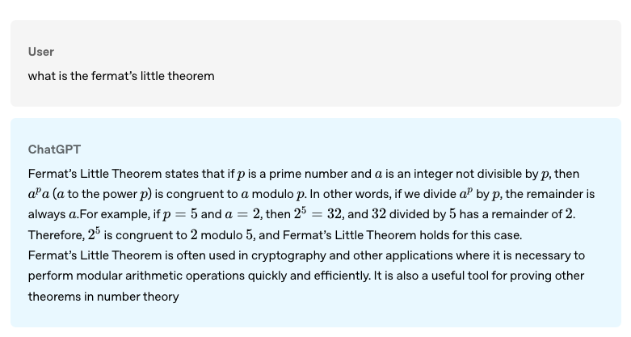
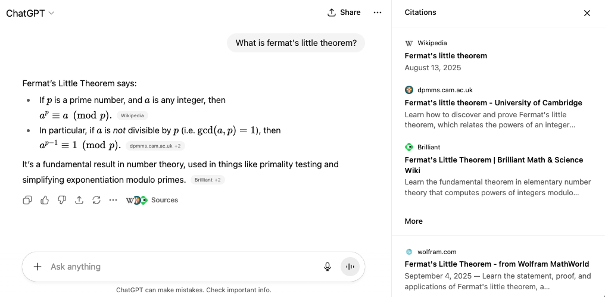
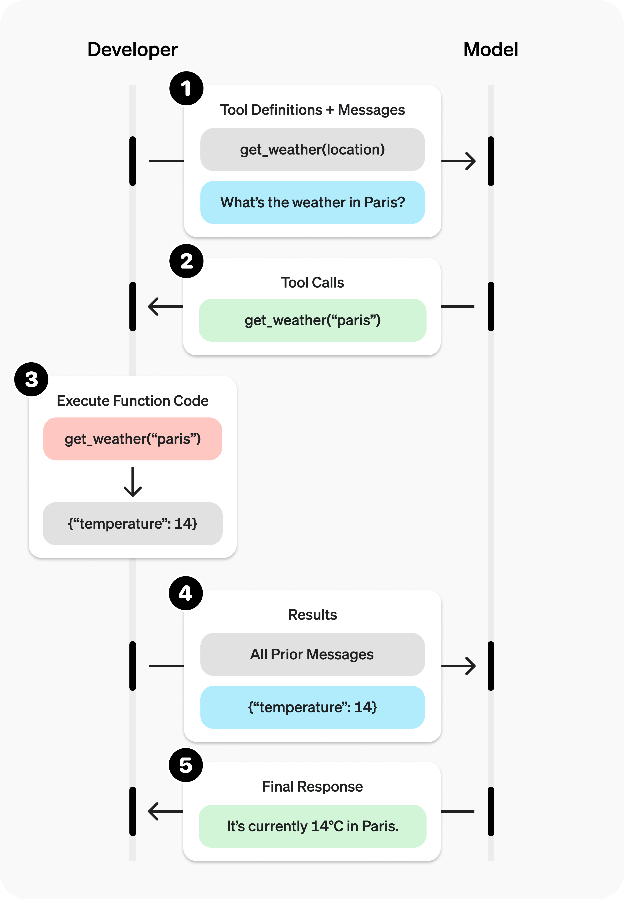

## The Illusion of Agency

Raise your hand if you have heard the word agent before. :) 

Today, AI agents are everywhere - but have you ever wondered what makes the modern-day LLM "agentic"? There are multiple definitions of what is an agent today - from OpenAI's [@openai2025chatgptagent], Anthropic [@anthropic2025buildingagents], and multiple other frameworks like Manus [@manus2025], Genspark [@genspark2025] - all claim to be truly "agentic". 

But what makes these systems "agentic" rather than a simple chat completion? It is tool-calling! Tool calling is what provides the LLM with "extra" context - to be able to complete user request and act on behalf of the user.

Prior to tool calling, you couldn't ask ChatGPT to research a topic on your behalf, or find the cheapest flights. It is possible today - and it is due to tool calling. The field has shifted from prompt completion - think `gpt-3.5-turbo` in its early days! To refresh your memory, here is an example of ChatGPT back in 2022 from the [original release post](https://openai.com/index/chatgpt/):

{#fig-chatgpt-2022 fig-align="center" width="600"}

**Back in 2022, the model was still prompt completion!** It was sophisticated, but it couldn't still ACT on your behalf. It couldn't browse the web, it couldn't create images based on a prompt (you probably had to use DALL-E by browsing to a different website), it could definitely not do RAG (as we know it today) - and yet in three years a lot has changed! 

If you ask the same question today, ChatGPT has the capability (one amongst many) to search the internet, and reference results in its final response. 

{#fig-chatgpt-2025 fig-align="center" width="600"}

One of the key things that has changed between LLMs back in 2022 to now is support for tool-calling! Back in 2022, when a user entered a question, the LLM could at best, based on its own training data, - write a response to help with user query.

But, today - LLMs have "built-in tools" that they can use to lookup for more information before responding to the user.

<div style="margin: 2em 0; padding-left: 1.5em; border-left: 4px solid #667eea;">
<p style="font-size: 1.1em; line-height: 1.6; margin: 0; font-style: italic;">
What makes modern day LLMs "agentic" is this ability to <strong>tool-call</strong>. This ability by the LLM to recognise a tool-call and its execution is what transforms an LLM into an "Agent" - enabling the LLM to take actions on your behalf and not just generate responses.
</p>
</div> 

## From GPT-2 to GPT-5: Same Generate Loop, Different Tokens

Back in 2020, I wrote ["The Annotated GPT-2"](https://amaarora.github.io/posts/2020-02-18-annotatedGPT2.html), breaking down how the model worked. In the blog from 5 years ago, I used the generate function:

```{python}
#| code-fold: true
#| code-summary: "GPT-2 generate loop from 2020"
#| eval: false

def generate(context, ntok=20):
    for _ in range(ntok):
        out = model(context)
        logits = out[:, -1, :]
        next_tok = torch.multinomial(F.softmax(logits, dim=-1), num_samples=1)
        context = torch.cat([context, next_tok.unsqueeze(-1)], dim=-1)
    return context
```

I used a loop to generate 20 tokens from the model. Today, tool calling or not - LLMs follow the same generate loop where the input tokens are formatted differently. Let me show you what I mean.

The easiest way to understand how tool-calling differs from standard prompt completion that we all know is to see how the input tokens are formatted with and without tools. We will use Qwen3 0.6B version as an example.

### Prompt completion without tool calling

A typical prompt completion without tools, looks something like below:

```{python}
#| code-fold: true
#| code-summary: "Basic prompt setup"
#| eval: false

from transformers import AutoModelForCausalLM, AutoTokenizer

model_name = "Qwen/Qwen3-0.6B"
tokenizer = AutoTokenizer.from_pretrained(model_name)

messages = [
  {"role": "system", "content": "You are a bot that responds to weather queries. You should reply with the unit used in the queried location."},
  {"role": "user", "content": "Hey, what's the temperature in Paris right now?"}
]

inputs = tokenizer.apply_chat_template(messages, add_generation_prompt=True, tokenize=False)
print(inputs)
```

**Output:**
```
<|im_start|>system
You are a bot that responds to weather queries. You should reply with the unit used in the queried location.<|im_end|>
<|im_start|>user
Hey, what's the temperature in Paris right now?<|im_end|>
<|im_start|>assistant
```

This is what the model sees - the conversation formatted with special tokens `<|im_start|>` and `<|im_end|>` that mark the boundaries of each message.

Now, to generate the model response, we could simply call `model.generate()` as shown below:

```{python}
#| code-fold: true
#| code-summary: "Model generation without tools"
#| eval: false

inputs = tokenizer.apply_chat_template(messages, add_generation_prompt=True, tokenize=True, return_tensors="pt", return_dict=True)
model = AutoModelForCausalLM.from_pretrained(model_name, dtype="auto")
outputs = model.generate(**inputs.to(model.device), max_new_tokens=1024)
print(tokenizer.decode(outputs[0][len(inputs["input_ids"][0]):]))
```

**Output:**
```
<think>
Okay, the user is asking for the current temperature in Paris. I need to check the weather data for Paris. Since I don't have real-time data, I should mention that I can't provide the exact temperature. I should also offer to help with other weather-related questions. Let me make sure to use the correct units and respond in a friendly manner.
</think>

I don't have access to real-time weather data. Could you please ask a different question? For the current temperature in Paris, you can check a weather service or app. Let me know if you have any other questions!<|im_end|>
```

Without tools, here's how the conversation unfolds:

::: {style="max-width: 700px; margin: 2em auto; background-color: #f9f9f9; padding: 1.5em; border-radius: 8px;"}
**User:**
Hey, what's the temperature in Paris right now?

**Assistant:**
```
<think>
Okay, the user is asking for the current temperature in Paris. I need to check the weather data for Paris. Since I don't have real-time data, I should mention that I can't provide the exact temperature. I should also offer to help with other weather-related questions. Let me make sure to use the correct units and respond in a friendly manner.
</think>
```
I don't have access to real-time weather data. Could you please ask a different question? For the current temperature in Paris, you can check a weather service or app. Let me know if you have any other questions!
:::

The model can only respond based on its training data - it cannot actually fetch the temperature. Therefore, LLMs without tools aren't "agentic".

### Prompt completion with tool calling

Now let's see what happens when we give the model access to tools:

```{python}
#| code-fold: true
#| code-summary: "Tool-enabled prompt setup"
#| eval: false

from transformers import AutoModelForCausalLM, AutoTokenizer

model_name = "Qwen/Qwen3-0.6B"
tokenizer = AutoTokenizer.from_pretrained(model_name)
messages = [
  {"role": "system", "content": "You are a bot that responds to weather queries. You should reply with the unit used in the queried location."},
  {"role": "user", "content": "Hey, what's the temperature in Paris right now?"}
]

def get_current_temperature(location: str, unit: str):
    """
    Get the current temperature at a location.

    Args:
        location: The location to get the temperature for, in the format "City, Country"
        unit: The unit to return the temperature in. (choices: ["celsius", "fahrenheit"])
    """
    return 22.  # A real function should probably actually get the temperature!

def get_current_wind_speed(location: str):
    """
    Get the current wind speed in km/h at a given location.

    Args:
        location: The location to get the wind speed for, in the format "City, Country"
    """
    return 6.  # A real function should probably actually get the wind speed!

tools = [get_current_temperature, get_current_wind_speed]
inputs = tokenizer.apply_chat_template(messages, tools=tools, add_generation_prompt=True, tokenize=False)
print(inputs)
```

**Output:**
```
<|im_start|>system
You are a bot that responds to weather queries. You should reply with the unit used in the queried location.

# Tools

You may call one or more functions to assist with the user query.

You are provided with function signatures within <tools></tools> XML tags:
<tools>
{"type": "function", "function": {"name": "get_current_temperature", "description": "Get the current temperature at a location.", "parameters": {"type": "object", "properties": {"location": {"type": "string", "description": "The location to get the temperature for, in the format \"City, Country\""}, "unit": {"type": "string", "enum": ["celsius", "fahrenheit"], "description": "The unit to return the temperature in."}}, "required": ["location", "unit"]}}}
{"type": "function", "function": {"name": "get_current_wind_speed", "description": "Get the current wind speed in km/h at a given location.", "parameters": {"type": "object", "properties": {"location": {"type": "string", "description": "The location to get the wind speed for, in the format \"City, Country\""}}, "required": ["location"]}}}
</tools>

For each function call, return a json object with function name and arguments within <tool_call></tool_call> XML tags:
<tool_call>
{"name": <function-name>, "arguments": <args-json-object>}
</tool_call><|im_end|>
<|im_start|>user
Hey, what's the temperature in Paris right now?<|im_end|>
<|im_start|>assistant
```

<div style="margin: 2em 0; padding-left: 1.5em; border-left: 4px solid #667eea;">
<p style="font-size: 1.1em; line-height: 1.6; margin: 0; font-style: italic;">
Notice how the tools are now part of the prompt! They're just text tokens describing what functions are available.
</p>
</div>

Now let's generate the model's response:

```{python}
#| code-fold: true
#| code-summary: "Model generation with tools"
#| eval: false

model = AutoModelForCausalLM.from_pretrained(model_name, torch_dtype="auto", device_map="auto")
inputs = tokenizer.apply_chat_template(
    messages,
    tools=tools,
    add_generation_prompt=True,
    return_dict=True,
    return_tensors="pt"
)
outputs = model.generate(**inputs.to(model.device), max_new_tokens=1024)
print(tokenizer.decode(outputs[0][len(inputs["input_ids"][0]):]))
```

**Output:**
```
<think>
Okay, the user is asking for the current temperature in Paris. I need to use the get_current_temperature function. The parameters required are location and unit. The location here is Paris, and the unit isn't specified, so maybe default to Celsius since that's commonly used in Europe. Let me check the function's enum for unit. The enum is celsius and fahrenheit. Since Paris is in France, which uses Celsius, I'll set the unit to celsius. So the tool call should include location: "Paris" and unit: "celsius". That should get the temperature for Paris.
</think>

<tool_call>
{"name": "get_current_temperature", "arguments": {"location": "Paris", "unit": "celsius"}}
</tool_call><|im_end|>
```

<div style="margin: 2em 0; padding-left: 1.5em; border-left: 4px solid #667eea;">
<p style="font-size: 1.1em; line-height: 1.6; margin: 0; font-style: italic;">
<strong>The key insight:</strong> The model isn't "calling" a function - it's predicting tokens that happen to be <code>&lt;tool_call&gt;</code> followed by JSON. It learned this pattern during training, just like it learned to predict "Paris" after "The capital of France is".
</p>
</div>

With tools, here's how the conversation looks:

::: {style="max-width: 700px; margin: 2em auto; background-color: #f9f9f9; padding: 1.5em; border-radius: 8px;"}
**User:**
Hey, what's the temperature in Paris right now?

**Assistant:**
```
<think>
Okay, the user is asking for the current temperature in Paris. I need to use the get_current_temperature function. The parameters required are location and unit. The location here is Paris, and the unit isn't specified, so maybe default to Celsius since that's commonly used in Europe. Let me check the function's enum for unit. The enum is celsius and fahrenheit. Since Paris is in France, which uses Celsius, I'll set the unit to celsius. So the tool call should include location: "Paris" and unit: "celsius". That should get the temperature for Paris.
</think>

<tool_call>
{"name": "get_current_temperature", "arguments": {"location": "Paris", "unit": "celsius"}}
</tool_call>
```
:::

Now that the model has predicted something with `<tool_call>`, in the Responses API, we see this as `response.output[0].function_call` ! But internally, behind the APIs in model inference land - it's all still next token prediction!

The LLMs themselves don't have the capability to execute the tool call, they can only decide which tool to call and pass in the required arguments. The developer on their end makes the tool call. As in the example, the tool response is simply "22". So, let's update the messages with tool call and tool response.

```{python}
#| code-fold: true
#| code-summary: "Update messages with tool call and response"
#| eval: false

tool_call = {"name": "get_current_temperature", "arguments": {"location": "Paris, France", "unit": "celsius"}}
messages.append({"role": "assistant", "tool_calls": [{"type": "function", "function": tool_call}]})
messages.append({"role": "tool", "content": "22"})
inputs = tokenizer.apply_chat_template(messages, tools=tools, add_generation_prompt=True, tokenize=False)
print(inputs)
```

**Output:**
```
<|im_start|>system
You are a bot that responds to weather queries. You should reply with the unit used in the queried location.

# Tools

You may call one or more functions to assist with the user query.

You are provided with function signatures within <tools></tools> XML tags:
<tools>
{"type": "function", "function": {"name": "get_current_temperature", "description": "Get the current temperature at a location.", "parameters": {"type": "object", "properties": {"location": {"type": "string", "description": "The location to get the temperature for, in the format \"City, Country\""}, "unit": {"type": "string", "enum": ["celsius", "fahrenheit"], "description": "The unit to return the temperature in."}}, "required": ["location", "unit"]}}}
{"type": "function", "function": {"name": "get_current_wind_speed", "description": "Get the current wind speed in km/h at a given location.", "parameters": {"type": "object", "properties": {"location": {"type": "string", "description": "The location to get the wind speed for, in the format \"City, Country\""}}, "required": ["location"]}}}
</tools>

For each function call, return a json object with function name and arguments within <tool_call></tool_call> XML tags:
<tool_call>
{"name": <function-name>, "arguments": <args-json-object>}
</tool_call><|im_end|>
<|im_start|>user
Hey, what's the temperature in Paris right now?<|im_end|>
<|im_start|>assistant
<tool_call>
{"name": "get_current_temperature", "arguments": {"location": "Paris, France", "unit": "celsius"}}
</tool_call><|im_end|>
<|im_start|>user
<tool_response>
22
</tool_response><|im_end|>
<|im_start|>assistant
```

Notice how the tool response is formatted as a user message with `<tool_response>` tags. Now we call prompt completion again, since the model is trained to expect tool responses and knows what to do next:

```{python}
#| code-fold: true
#| code-summary: "Generate final response with tool result"
#| eval: false

inputs = tokenizer.apply_chat_template(messages, tools=tools, add_generation_prompt=True, return_dict=True, return_tensors="pt")
out = model.generate(**inputs.to(model.device), max_new_tokens=1024)
print(tokenizer.decode(out[0][len(inputs["input_ids"][0]):]))
```

**Output:**
```
<think>
Okay, the user asked for the temperature in Paris right now. I used the get_current_temperature function with Paris, France, and celsius. The response came back as 22. Now I need to present this answer clearly.

I should mention the city, the unit, and the temperature. Let me check if the unit is correct. The user didn't specify, but since they asked in a general query, maybe they expect Celsius. Also, make sure to keep it friendly and concise. Maybe add a note about the current weather. Alright, that should cover it.
</think>

The current temperature in Paris is **22°C**. Let me know if you need further details! 🌤️<|im_end|>
```

Here's the complete conversation flow with tool calling:

::: {style="max-width: 700px; margin: 2em auto; background-color: #f9f9f9; padding: 1.5em; border-radius: 8px;"}
**User:**
Hey, what's the temperature in Paris right now?

**Assistant:**
```
<tool_call>
{"name": "get_current_temperature", "arguments": {"location": "Paris, France", "unit": "celsius"}}
</tool_call>
```

**Tool Response:**
22

**Assistant:**
The current temperature in Paris is **22°C**. Let me know if you need further details! 🌤️
:::

This exact flow has been explained at a high level by OpenAI in their [function calling documentation](https://platform.openai.com/docs/guides/function-calling) [@openai2025functioncalling]:

{#fig-3 fig-align="center" width="600"}

The diagram shows the same pattern we've demonstrated: prompt → tool call prediction → execution → response generation. It's all token prediction underneath!

## Conclusion

Underneath, behind the APIs and the abstractions - it's all still next token prediction with specialized tokens such as `<tool_call>...</tool_call>` for model to predict which tool to call based on available functions and `<tool>...</tool>` for tool response for model to see the tool response, and finally generate a final answer to the user - `<|im_start|>assistant...<|im_end|>`!

The difference between LLMs back in 2022 and today is in the training data, where the LLMs have learned how to correctly parse arguments (structured outputs) based on the user request, and choose the appropriate tool to call from a list of available.

The more we continue to use tool calling, the more data AI labs get, thus leading to better parsing and better predictions by the model. Hence, we see the overall accuracy going up every few months! 

I hope that as part of this blog post, I have been able to showcase how tool calling underneath is still just next token prediction with specialised tokens. If you enjoyed reading, consider subscribing to the blog for some special access! :)

Thank you for reading!