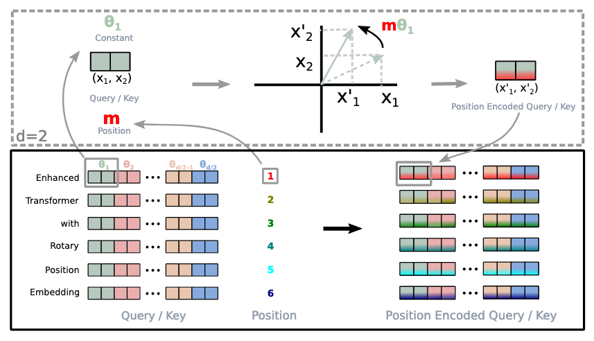
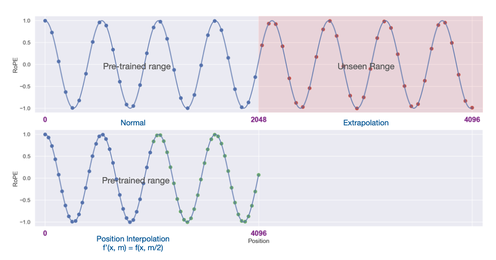

<style>
/* Custom TOC styling */
.quarto-title-meta-contents a,
nav#TOC a {
    color: #555 !important; /* Gray color */
    text-decoration: underline;
    text-underline-offset: 2px;
}

nav#TOC a:hover {
    color: #000 !important; /* Darker on hover */
    text-decoration-color: #000;
}

nav#TOC > ul > li > a {
    font-weight: 500;
}
</style>

## Introduction

If we look back 8 years ago, we will notice that the original Transformer architecture came with a context length of 512 tokens! Fast forward to today, and we have model Grok-4-fast that was released with 2M context length! [@xai2025grok4fast] The Gemini series was the first to allow accepting 1 million tokens. [@google2025gemini]

In the world of agents, where context deeply affects, context lengths play a crucial role in supporting the industry reach new state of the art solutions and integrations with Large language models. The recent accomplishment from Tongyi Labs introducing Tongyi Deepresearch [@tongyi2025deepresearch] termed the 128K context length as insufficient! Often times using Claude Code, we run into  context limits - where the conversation is then "compacted" by the terminal agent. On the other hand, Gemini CLI has a massive 1M context length! While at longer context, the accuracy of retrieval reduces, there are techniques to suppress that and it is pretty handy to have larger context lengths.

However, the improvement in context length didn't come from model architecture upgrades alone. In addition to the chosen attention mechanism, positional embeddings play a crucial role in long context modeling. [@yang2025ropenopeagainnew]

As part of this blog post, you and I are going to take a deep dive into techniques that have enabled context length improvements since the original Transformer architecture was introduced in 2017! For every technique, I have also included it's PyTorch implementation - either from Huggingface or the repository shared by the paper itself along with intuitive and practical explanations that I hope the reader finds easy to follow. 

We kickstart the journey with absolute positional embeddings, and learn how each dimensions are oscillating at different frequencies allowing for unique fingerprints, or absolute position coordinates for tokens in a sequence. We follow this up with rotary embeddings (RoPE), and also get an intuitive understanding of simply thinking in complex number terms, helps embed position information into embedding vectors through rotation. RoPE encodes the absolute position with a rotation matrix and meanwhile incorporates the explicit relative position dependency in self-attention formulation. Finally, we look into three adaptions of RoPE - namely NTK aware RoPE, dynamic scaling and NTK by parts. Some of these innovations were in fact announced as Reddit posts! Lastly, we look at YaRN - "Yet Another rope extentioN" method which combines NTK by parts with an introduction of temperature parameter to the attention formulation. **Most modern LLMs today such as Qwen, DeepSeek, LLaMA, gpt-oss are finetuned using YaRN to enable context length expansion only utilising a small percentage of the pre-trained dataset.**

With that being, let's get started!

## APE (Absolute positional embeddings) {#sec-ape}

In the original Transformer paper [@attention], the authors used sine and cosine functions of different frequencies for positional encoding:

$$PE_{(pos,2i)} = \sin(pos/10000^{2i/d_{model}})$$

$$PE_{(pos,2i+1)} = \cos(pos/10000^{2i/d_{model}})$$

where $pos$ is the position and $i$ is the dimension. That is, each dimension of the positional encoding corresponds to a sinusoid. The wavelengths form a geometric progression from $2\pi$ to $10000 \cdot 2\pi$. The authors chose this function because they hypothesized it would allow the model to easily learn to attend by relative positions, since for any fixed offset $k$, $PE_{pos+k}$ can be represented as a linear function of $PE_{pos}$.

In addition, dropout is applied to the sums of the embeddings and the positional encodings in both the encoder and decoder stacks. For the base model, a dropout rate of $P_{drop} = 0.1$ is used.

Here's the PyTorch implementation of absolute positional encodings:

```python
class PositionalEncoding(nn.Module):
    """Implement the PE function."""

    def __init__(self, d_model, dropout, max_len=5000):
        super(PositionalEncoding, self).__init__()
        self.dropout = nn.Dropout(p=dropout)

        pe = torch.zeros(max_len, d_model)
        position = torch.arange(0, max_len).unsqueeze(1)
        div_term = torch.exp(
            torch.arange(0, d_model, 2) * -(math.log(10000.0) / d_model)
        )
        pe[:, 0::2] = torch.sin(position * div_term)
        pe[:, 1::2] = torch.cos(position * div_term)
        pe = pe.unsqueeze(0)
        self.register_buffer("pe", pe)

    def forward(self, x):
        x = x + self.pe[:, : x.size(1)].requires_grad_(False)
        return self.dropout(x)
```

::: {.callout-tip}
## Further Reading
For a comprehensive deep dive into the original Transformer architecture and positional encodings, check out [The Annotated Transformer](https://nlp.seas.harvard.edu/annotated-transformer/#positional-encoding) which provides a line-by-line implementation walkthrough of the paper "Attention is All You Need".
:::

### Visualizing Positional Encoding Frequencies

Each dimension oscillates at a different frequency. As a result, each position gets a unique encoding - think of it like a fingerprint. Lower dimensions oscillate rapidly while higher dimensions change slowly:

```{python}
#| code-fold: false
#| code-summary: "Show visualization code"
#| fig-cap: "Sinusoidal positional encodings showing how different dimensions have different frequencies. Dimensions 4 and 6 use sine, while 5 and 7 use cosine."

import warnings
warnings.filterwarnings('ignore')

import torch
import torch.nn as nn
import math
import pandas as pd
import altair as alt

class PositionalEncoding(nn.Module):
    def __init__(self, d_model, dropout, max_len=5000):
        super(PositionalEncoding, self).__init__()
        self.dropout = nn.Dropout(p=dropout)

        pe = torch.zeros(max_len, d_model)
        position = torch.arange(0, max_len).unsqueeze(1)
        div_term = torch.exp(
            torch.arange(0, d_model, 2) * -(math.log(10000.0) / d_model)
        )
        pe[:, 0::2] = torch.sin(position * div_term)
        pe[:, 1::2] = torch.cos(position * div_term)
        pe = pe.unsqueeze(0)
        self.register_buffer("pe", pe)

    def forward(self, x):
        x = x + self.pe[:, : x.size(1)].requires_grad_(False)
        return self.dropout(x)

def example_positional():
    pe = PositionalEncoding(20, 0)
    y = pe.forward(torch.zeros(1, 100, 20))

    data_list = []
    for dim in [4, 5, 6, 7]:
        dim_type = 'sin' if dim % 2 == 0 else 'cos'
        for pos in range(100):
            data_list.append({
                "embedding": float(y[0, pos, dim].detach().numpy()),
                "dimension": f"Dim {dim} ({dim_type})",
                "position": pos
            })

    data = pd.DataFrame(data_list)

    chart = (
        alt.Chart(data)
        .mark_line(strokeWidth=2.5)
        .properties(
            width=800,
            height=400,
            title="Positional Encoding: Different Frequencies per Dimension"
        )
        .encode(
            x=alt.X("position", title="Position in Sequence"),
            y=alt.Y("embedding", title="Encoding Value", scale=alt.Scale(domain=[-1.1, 1.1])),
            color=alt.Color("dimension:N", title="Dimension", legend=alt.Legend(orient="top")),
            tooltip=[
                alt.Tooltip("position:Q", title="Position"),
                alt.Tooltip("embedding:Q", title="Value", format=".3f"),
                alt.Tooltip("dimension:N", title="Dimension")
            ]
        )
        .interactive()
    )

    return chart

# Show the visualization
chart = example_positional()
chart
```

Essentially, each dimension is oscillating at a different frequency. As a result of which, each position gets a unique encoding - like a fingerprint - that distinguishes it from every other position in the sequence.

### Understanding Position Fingerprints {#sec-position-fingerprints}

Let's visualize how different positions create unique encodings and how the model learns proximity:

```{python}
#| code-fold: true
#| code-summary: "Show code for position fingerprint visualization"

import warnings
warnings.filterwarnings('ignore')

import torch
import torch.nn as nn
import math
import pandas as pd
import altair as alt
import numpy as np

class PositionalEncoding(nn.Module):
    def __init__(self, d_model, dropout, max_len=5000):
        super(PositionalEncoding, self).__init__()
        self.dropout = nn.Dropout(p=dropout)

        pe = torch.zeros(max_len, d_model)
        position = torch.arange(0, max_len).unsqueeze(1)
        div_term = torch.exp(
            torch.arange(0, d_model, 2) * -(math.log(10000.0) / d_model)
        )
        pe[:, 0::2] = torch.sin(position * div_term)
        pe[:, 1::2] = torch.cos(position * div_term)
        pe = pe.unsqueeze(0)
        self.register_buffer("pe", pe)

    def forward(self, x):
        x = x + self.pe[:, : x.size(1)].requires_grad_(False)
        return self.dropout(x)

def visualize_position_slices():
    pe = PositionalEncoding(20, 0)
    y = pe.forward(torch.zeros(1, 100, 20))

    highlight_positions = [4, 8, 50]

    positions = []
    embeddings = []
    dimensions = []

    for dim in [4, 5, 6, 7]:
        dim_type = 'sin' if dim % 2 == 0 else 'cos'
        dim_label = f"Dim {dim} ({dim_type})"
        for pos in range(100):
            positions.append(pos)
            embeddings.append(float(y[0, pos, dim].detach().numpy()))
            dimensions.append(dim_label)

    line_df = pd.DataFrame({
        'position': np.array(positions, dtype=np.int32),
        'embedding': np.array(embeddings, dtype=np.float32),
        'dimension': np.array(dimensions, dtype=object)
    })

    h_positions = []
    h_y = []
    h_labels = []

    for pos in highlight_positions:
        for val in np.linspace(-1.1, 1.1, 50):
            h_positions.append(pos)
            h_y.append(float(val))
            h_labels.append(f"Position {pos}")

    highlight_df = pd.DataFrame({
        'position': np.array(h_positions, dtype=np.int32),
        'y': np.array(h_y, dtype=np.float32),
        'label': np.array(h_labels, dtype=object)
    })

    p_positions = []
    p_embeddings = []
    p_dimensions = []
    p_labels = []

    for pos in highlight_positions:
        for dim in [4, 5, 6, 7]:
            dim_type = 'sin' if dim % 2 == 0 else 'cos'
            p_positions.append(pos)
            p_embeddings.append(float(y[0, pos, dim].detach().numpy()))
            p_dimensions.append(f"Dim {dim} ({dim_type})")
            p_labels.append(f"Pos {pos}")

    points_df = pd.DataFrame({
        'position': np.array(p_positions, dtype=np.int32),
        'embedding': np.array(p_embeddings, dtype=np.float32),
        'dimension': np.array(p_dimensions, dtype=object),
        'label': np.array(p_labels, dtype=object)
    })
    line_chart = (
        alt.Chart(line_df)
        .mark_line(strokeWidth=2.5, opacity=0.7)
        .encode(
            x=alt.X("position:Q", title="Position in Sequence"),
            y=alt.Y("embedding:Q", title="Encoding Value", scale=alt.Scale(domain=[-1.1, 1.1])),
            color=alt.Color("dimension:N", title="Dimension", legend=alt.Legend(orient="top"))
        )
    )

    rules = (
        alt.Chart(highlight_df)
        .mark_line(strokeDash=[5, 5], opacity=0.5)
        .encode(
            x="position:Q",
            y="y:Q",
            color=alt.Color("label:N", scale=alt.Scale(scheme="dark2"), legend=alt.Legend(title="Highlighted Positions"))
        )
    )

    points = (
        alt.Chart(points_df)
        .mark_point(size=100, filled=True)
        .encode(
            x="position:Q",
            y="embedding:Q",
            color=alt.Color("dimension:N", legend=None),
            shape=alt.Shape("label:N", legend=None),
            tooltip=[
                alt.Tooltip("position:Q", title="Position"),
                alt.Tooltip("embedding:Q", title="Value", format=".3f"),
                alt.Tooltip("dimension:N", title="Dimension")
            ]
        )
    )

    final_chart = (
        (rules + line_chart + points)
        .properties(
            width=800,
            height=400,
            title="Position Encodings as Unique Fingerprints"
        )
        .interactive()
    )

    return final_chart, y

chart, embeddings = visualize_position_slices()
chart
```

```{python}
#| code-fold: true

print("🔍 Position Fingerprints (showing dims 4-7 only):\n")
print("Position 4:  [%.2f, %.2f, %.2f, %.2f]" % tuple(embeddings[0, 4, 4:8].detach().numpy()))
print("Position 8:  [%.2f, %.2f, %.2f, %.2f]" % tuple(embeddings[0, 8, 4:8].detach().numpy()))
print("Position 50: [%.2f, %.2f, %.2f, %.2f]" % tuple(embeddings[0, 50, 4:8].detach().numpy()))
```

**Note:** While we only visualize 4 dimensions for clarity, in practice each position is encoded using the model's full embedding dimension (typically 512, 1024, or 2048 dimensions). The same frequency pattern applies across all dimensions, creating an even more unique fingerprint for each position.

::: {.callout-tip}
## 💡 The Key Insight

Each dimension oscillates at different frequencies. Lower dimensions oscillate faster, whereas higher dimensions oscillate slower. As a result, each position gets a unique fingerprint - like GPS coordinates that let the attention mechanism know exactly where it is in the sequence.

For positions close to each other, the slower dimensions have not changed much. The model learns these positions are "neighbours". Whereas for positions further away from each other, for example position 2 and position 50, even the slower dimensions have had time to change. This way the model learns these positions are distant from each other.
:::

### Why Can't We Just Extend APE? The Scaling Problem

You might wonder: "If position 1024 just needs encoding values, why not simply compute sin/cos for positions beyond 1024?" Here's why this doesn't work:

#### The Training-Inference Mismatch

When a model is trained with context length 1024:

1. It only sees position encodings for 0-1023 during training
2. The attention mechanism learns specific patterns: "When I see these encoding values, tokens are X positions apart"
3. Position 1024+ creates encoding patterns the model has **never seen during training**

> Think of it like this: You train a GPS system on Earth coordinates, then suddenly ask it to navigate on Mars. The math still works, but the system has no idea what the new coordinates mean!

#### The Performance Cliff

Here's empirical evidence from [@chen2023extendingcontextwindowlarge] showing what happens when you try to extend APE beyond training length. They measure **effective context window size** using a passkey retrieval task [@mohtashami2023landmarkattentionrandomaccessinfinite]:

::: {.callout-note}
## The Passkey Retrieval Task
A practical test of whether models can actually use their full context window. The prompt format:

```
There is an important info hidden inside a lot of irrelevant text.
Find it and memorize them. I will quiz you about the important information there.
The grass is green. The sky is blue. The sun is yellow. Here we go.
There and back again. (repeat X times)
The pass key is 12345. Remember it. 12345 is the pass key.
The grass is green. The sky is blue. The sun is yellow. Here we go.
There and back again. (repeat Y times)
What is the pass key? The pass key is ___
```

The model must retrieve the 5-digit passkey buried in thousands of tokens of repetitive text. If the model can't find it, it means it cannot effectively use that portion of its context window.
:::

```{python}
#| code-fold: true
#| code-summary: "Show code for table generation"

import pandas as pd
import IPython.display as display

data = pd.DataFrame({
    'Model': ['7B', '7B', '7B', '7B', '7B', '7B',
              '33B', '33B', '33B', '33B', '33B'],
    'Fine-tuning Steps': [200, 400, 600, 800, 1000, 10000,
                          200, 400, 600, 800, 1000],
    'Effective Context': [1792, 2048, 2048, 2048, 2304, 2560,
                          1792, 2048, 1792, 2048, 2304]
})

pivot_df = data.pivot(index='Model', columns='Fine-tuning Steps', values='Effective Context')
pivot_df = pivot_df.fillna('-')

html_table = f"""
<table style="width:100%; text-align:center; border-collapse: collapse;">
<caption style="caption-side: top; margin-bottom: 10px; font-weight: bold;">
Table 1: Effective context window sizes after fine-tuning. FT: Direct fine-tuning. (From Chen et al., 2023)
</caption>
<thead>
<tr style="background-color: #f2f2f2;">
<th rowspan="2" style="border: 1px solid #ddd; padding: 8px;">Model<br>Size</th>
<th rowspan="2" style="border: 1px solid #ddd; padding: 8px;">Context<br>Window</th>
<th rowspan="2" style="border: 1px solid #ddd; padding: 8px;">Method</th>
<th colspan="6" style="border: 1px solid #ddd; padding: 8px;">Fine-tuning Steps</th>
</tr>
<tr style="background-color: #f2f2f2;">
<th style="border: 1px solid #ddd; padding: 8px;">200</th>
<th style="border: 1px solid #ddd; padding: 8px;">400</th>
<th style="border: 1px solid #ddd; padding: 8px;">600</th>
<th style="border: 1px solid #ddd; padding: 8px;">800</th>
<th style="border: 1px solid #ddd; padding: 8px;">1000</th>
<th style="border: 1px solid #ddd; padding: 8px;">10000</th>
</tr>
</thead>
<tbody>
<tr>
<td style="border: 1px solid #ddd; padding: 8px;">7B</td>
<td style="border: 1px solid #ddd; padding: 8px;">8192</td>
<td style="border: 1px solid #ddd; padding: 8px;">FT</td>
<td style="border: 1px solid #ddd; padding: 8px;">1792</td>
<td style="border: 1px solid #ddd; padding: 8px;">2048</td>
<td style="border: 1px solid #ddd; padding: 8px;">2048</td>
<td style="border: 1px solid #ddd; padding: 8px;">2048</td>
<td style="border: 1px solid #ddd; padding: 8px;">2304</td>
<td style="border: 1px solid #ddd; padding: 8px;">2560</td>
</tr>
<tr style="background-color: #f9f9f9;">
<td style="border: 1px solid #ddd; padding: 8px;">33B</td>
<td style="border: 1px solid #ddd; padding: 8px;">8192</td>
<td style="border: 1px solid #ddd; padding: 8px;">FT</td>
<td style="border: 1px solid #ddd; padding: 8px;">1792</td>
<td style="border: 1px solid #ddd; padding: 8px;">2048</td>
<td style="border: 1px solid #ddd; padding: 8px;">1792</td>
<td style="border: 1px solid #ddd; padding: 8px;">2048</td>
<td style="border: 1px solid #ddd; padding: 8px;">2304</td>
<td style="border: 1px solid #ddd; padding: 8px;">-</td>
</tr>
</tbody>
</table>
"""

display.HTML(html_table)
```

**Key observation**: Even with 10,000 fine-tuning steps, models can only achieve ~2560 effective context length when targeting 8192 tokens! That's less than 1/3 of the target. The model simply can't effectively use positions it wasn't trained on.

## RoFormer: Enhanced Transformer with Rotary Position Embedding (RoPE)

RoFormer [@roformer] introduced RoPE (Rotary Position Embeddings) in 2021, which due to its simplicity and effectiveness has since become the de facto standard in modern Large Language Models including Llama 3 [@grattafiori2024llama3herdmodels], Mistral, Gemma-2, and SmolLM3 [@huggingface2024smollm3]. I have previously covered rotary embeddings in my previous blog post on [Gemma 2](https://amaarora.github.io/posts/2024-07-07%20Gemma.html#sec-rope). But, in this blog post, I will try to develop an intuition for the readers for RoPE similar to APE.

Before we get into the intuitive understanding, let's first formally define the problem statement.

### Formulation

From the paper [@roformer],

Transformer-based language modeling usually leverages the position information of individual tokens through a self-attention mechanism. As is observed in self-attention, $q_m^T k_n$ typically enables knowledge conveyance between tokens at different positions. In order to incorporate relative position information, we require the inner product of query $q_m$ and key $k_n$ to be formulated by a function $g$, which takes only the word embeddings $x_m$, $x_n$, and their relative position $m - n$ as input variables. In other words, we hope that the inner product encodes position information only in the relative form:

> Easier put, between two token embeddings $x_m$ & $x_n$ at different positions $m$ & $n$, we want the self attention inner product to be based on the embedding vectors (to have semantic representation of the tokens) and a function of the relative distance $m-n$ (to have positional information).

$$\langle f_q(x_m, m), f_k(x_n, n) \rangle = g(x_m, x_n, m - n)$$

From the paper [@roformer], 

*In this paper, we introduce a novel method, namely Rotary Position Embedding(RoPE), to leverage the positional information into the learning process of PLMS. Specifically, RoPE encodes the absolute position with a rotation matrix and meanwhile incorporates the explicit relative position dependency in self-attention formulation. Note that the proposed RoPE is prioritized over the existing methods through valuable properties, including the sequence length flexibility, decaying inter-token dependency with increasing relative distances, and the capability of equipping the linear self-attention with relative position encoding.*

{#fig-rope-implementation}

### Intuition behind RoPE

The idea in RoPE is extremely simple and intuitive to understand. As can be seen in the figure above, given a sequence **"Enhanced[1] transformer[2] with[3] Rotary[4] Position[5] Embedding[6]..."** where the numbers 1,2,3.. represent the absolute position of the token in the sequence, we rotate each token embedding by an angle proportional to its position. So the vector representation at position 1 gets rotated by $\theta$, vector representation at position 2 gets rotated by $2\theta$, and position $m$ gets rotated by $m\theta$.


Something you might note in the figure above is that the rotation is applied to pairs of dimensions (2,3), (4,5), (6,7), and (8,9). This is because RoPE applies 2D rotations to consecutive dimension pairs. Each dimension pair gets rotated by a different frequency, where:

$$\theta_i = 10000^{-2i/d}$$

where $i$ is the dimension pair index and $d$ is the total embedding dimension. This creates a spectrum of rotation frequencies - **lower dimensions rotate faster while higher dimensions rotate slower**, allowing the model to capture both short-range and long-range dependencies.

For example, with $d=128$ dimensions (as shown in the figure), we have 64 dimension pairs. Each pair gets rotated by $m\theta_i$ where $m$ is the position and $\theta_i$ is the base frequency:

**Base frequencies ($\theta_i$):**

$\theta_1 = 10000^{-0/128} = 1$ (for dims 0,1)

$\theta_2 = 10000^{-2/128} \approx 0.8660$ (for dims 2,3)

$\theta_3 = 10000^{-4/128} \approx 0.7499$ (for dims 4,5)

$\theta_4 = 10000^{-6/128} \approx 0.6494$ (for dims 6,7)

$\theta_5 = 10000^{-8/128} \approx 0.5623$ (for dims 8,9)

...

$\theta_{64} = 10000^{-126/128} \approx 0.0100$ (for dims 126,127)

**At position $m$ in the sequence:**

The actual rotation angles are $m\theta_1$, $m\theta_2$, $m\theta_3$, etc. For example, at position $m=5$ (the word "Position" in our example):

- Dims 0,1 rotate by: $m\theta_1 = 5 \times 1 = 5$ radians
- Dims 2,3 rotate by: $m\theta_2 = 5 \times 0.8660 \approx 4.33$ radians
- Dims 4,5 rotate by: $m\theta_3 = 5 \times 0.7499 \approx 3.75$ radians
- Dims 6,7 rotate by: $m\theta_4 = 5 \times 0.6494 \approx 3.25$ radians
- Dims 8,9 rotate by: $m\theta_5 = 5 \times 0.5623 \approx 2.81$ radians

This creates a spectrum where lower dimensions rotate faster (larger angles) while higher dimensions rotate slower (smaller angles), allowing the model to capture patterns at different scales.

```{=html}
<div style="background: white; border-radius: 10px; padding: 20px; margin: 20px 0; box-shadow: 0 2px 10px rgba(0,0,0,0.1);">
    <h3 style="text-align: center; color: #1f2937; margin-bottom: 10px; font-size: 1.2em; font-weight: 600;">Rotary Position Embeddings Visualization</h3>
    <div style="text-align: center; color: #6b7280; margin-bottom: 20px; font-size: 0.85em;">Dimension pairs: [2,3], [4,5], [6,7], [8,9]</div>

    <div style="display: flex; justify-content: center; align-items: center; gap: 30px; margin-bottom: 20px;">
        <div style="display: flex; align-items: center; gap: 15px;">
            <label style="font-weight: 500; color: #374151; font-size: 14px;">Position (m):</label>
            <input type="range" id="ropePositionSlider" min="0" max="512" value="0" step="1" style="width: 200px; cursor: pointer;">
            <div id="ropePositionDisplay" style="font-size: 18px; font-weight: 600; color: #2563eb; min-width: 50px; text-align: center;">0</div>
        </div>
        <button id="ropePlayButton" style="padding: 8px 16px; background: #3b82f6; color: white; border: none; border-radius: 6px; cursor: pointer; font-weight: 500; font-size: 14px; transition: background 0.2s;">▶ Play</button>
    </div>

    <div style="display: grid; grid-template-columns: 1fr 1fr; gap: 15px; margin-bottom: 20px; max-width: 600px; margin-left: auto; margin-right: auto;">
        <canvas id="ropeCanvas1" style="border: 2px solid #e2e8f0; border-radius: 10px; background: white; width: 100%; height: 280px;"></canvas>
        <canvas id="ropeCanvas2" style="border: 2px solid #e2e8f0; border-radius: 10px; background: white; width: 100%; height: 280px;"></canvas>
        <canvas id="ropeCanvas3" style="border: 2px solid #e2e8f0; border-radius: 10px; background: white; width: 100%; height: 280px;"></canvas>
        <canvas id="ropeCanvas4" style="border: 2px solid #e2e8f0; border-radius: 10px; background: white; width: 100%; height: 280px;"></canvas>
    </div>

    <div style="display: flex; gap: 20px; justify-content: center; margin-top: 20px; flex-wrap: wrap;">
        <div style="display: flex; align-items: center; gap: 5px; font-size: 12px; color: #4a5568;">
            <div style="width: 20px; height: 3px; background: #6b7280;"></div>
            <span>Original Vector</span>
        </div>
        <div style="display: flex; align-items: center; gap: 5px; font-size: 12px; color: #4a5568;">
            <div style="width: 20px; height: 3px; background: #1f2937;"></div>
            <span>Rotated Vector</span>
        </div>
        <div style="display: flex; align-items: center; gap: 5px; font-size: 12px; color: #4a5568;">
            <div style="width: 20px; height: 3px; background: rgba(31, 41, 55, 0.2);"></div>
            <span>Rotation Path</span>
        </div>
    </div>
</div>

<script>
(function() {
    const canvases = [
        document.getElementById('ropeCanvas1'),
        document.getElementById('ropeCanvas2'),
        document.getElementById('ropeCanvas3'),
        document.getElementById('ropeCanvas4')
    ];

    const contexts = canvases.map(c => c.getContext('2d'));
    const positionSlider = document.getElementById('ropePositionSlider');
    const positionDisplay = document.getElementById('ropePositionDisplay');
    const playButton = document.getElementById('ropePlayButton');

    let isPlaying = false;
    let animationId = null;

    const base = 10000;
    const d = 10;

    const thetas = [
        Math.pow(base, -2 * 1 / d),  // Dims [2,3]
        Math.pow(base, -4 / d),       // Dims [4,5]
        Math.pow(base, -6 / d),       // Dims [6,7]
        Math.pow(base, -8 / d)        // Dims [8,9]
    ];

    const pairInfo = [
        { label: 'Dims [2,3]', color: '#00CED1', desc: 'Highest Frequency' },
        { label: 'Dims [4,5]', color: '#4169E1', desc: 'High Frequency' },
        { label: 'Dims [6,7]', color: '#9370DB', desc: 'Medium Frequency' },
        { label: 'Dims [8,9]', color: '#FF6347', desc: 'Low Frequency' }
    ];

    function drawRotation(ctx, canvas, angle, pairIndex) {
        const width = canvas.width;
        const height = canvas.height;
        const centerX = width / 2;
        const centerY = height / 2;
        const radius = Math.min(width, height) * 0.3;

        ctx.clearRect(0, 0, width, height);

        // Draw grid
        ctx.strokeStyle = '#e2e8f0';
        ctx.lineWidth = 1;
        ctx.beginPath();
        ctx.moveTo(centerX, 0);
        ctx.lineTo(centerX, height);
        ctx.moveTo(0, centerY);
        ctx.lineTo(width, centerY);
        ctx.stroke();

        // Draw circle
        ctx.beginPath();
        ctx.arc(centerX, centerY, radius, 0, 2 * Math.PI);
        ctx.strokeStyle = '#cbd5e0';
        ctx.lineWidth = 2;
        ctx.stroke();

        // Draw rotation arc
        if (angle > 0) {
            ctx.beginPath();
            ctx.arc(centerX, centerY, radius * 0.9, 0, angle);
            ctx.strokeStyle = pairInfo[pairIndex].color + '30';
            ctx.lineWidth = radius * 0.8;
            ctx.stroke();
        }

        // Draw original vector
        ctx.beginPath();
        ctx.moveTo(centerX, centerY);
        ctx.lineTo(centerX + radius, centerY);
        ctx.strokeStyle = '#6b7280';
        ctx.lineWidth = 3;
        ctx.stroke();

        ctx.beginPath();
        ctx.arc(centerX + radius, centerY, 5, 0, 2 * Math.PI);
        ctx.fillStyle = '#6b7280';
        ctx.fill();

        // Draw rotated vector
        const rotX = centerX + radius * Math.cos(angle);
        const rotY = centerY + radius * Math.sin(angle);

        ctx.beginPath();
        ctx.moveTo(centerX, centerY);
        ctx.lineTo(rotX, rotY);
        ctx.strokeStyle = '#1f2937';
        ctx.lineWidth = 3;
        ctx.stroke();

        ctx.beginPath();
        ctx.arc(rotX, rotY, 5, 0, 2 * Math.PI);
        ctx.fillStyle = '#1f2937';
        ctx.fill();

        // Draw labels
        ctx.fillStyle = '#2d3748';
        ctx.font = 'bold 14px sans-serif';
        ctx.textAlign = 'center';
        ctx.fillText(pairInfo[pairIndex].label, centerX, 25);

        ctx.font = '12px sans-serif';
        ctx.fillStyle = '#718096';
        ctx.fillText(pairInfo[pairIndex].desc, centerX, 45);

        ctx.fillText(`θ = ${thetas[pairIndex].toExponential(2)}`, centerX, height - 35);

        const degrees = (angle * 180 / Math.PI) % 360;
        ctx.fillText(`Angle: ${degrees.toFixed(1)}°`, centerX, height - 15);

        const rotations = Math.floor(angle / (2 * Math.PI));
        if (rotations > 0) {
            ctx.fillStyle = pairInfo[pairIndex].color;
            ctx.font = 'bold 12px sans-serif';
            ctx.fillText(`${rotations} full rotation${rotations > 1 ? 's' : ''}`, centerX, 65);
        }
    }

    function updateVisualization(position) {
        for (let i = 0; i < 4; i++) {
            const angle = position * thetas[i];

            if (canvases[i].width === 0) {
                canvases[i].width = canvases[i].offsetWidth;
                canvases[i].height = canvases[i].offsetHeight;
            }

            drawRotation(contexts[i], canvases[i], angle, i);
        }
    }

    canvases.forEach(canvas => {
        canvas.width = canvas.offsetWidth;
        canvas.height = canvas.offsetHeight;
    });

    positionSlider.addEventListener('input', (e) => {
        const position = parseInt(e.target.value);
        positionDisplay.textContent = position;
        updateVisualization(position);
    });

    playButton.addEventListener('click', () => {
        if (isPlaying) {
            isPlaying = false;
            playButton.textContent = '▶ Play';
            if (animationId) {
                cancelAnimationFrame(animationId);
            }
        } else {
            isPlaying = true;
            playButton.textContent = '❚❚ Pause';
            animate();
        }
    });

    function animate() {
        if (!isPlaying) return;

        let position = parseInt(positionSlider.value);
        position = (position + 2) % 513;
        positionSlider.value = position;
        positionDisplay.textContent = position;
        updateVisualization(position);

        animationId = requestAnimationFrame(animate);
    }

    updateVisualization(0);

    window.addEventListener('resize', () => {
        canvases.forEach(canvas => {
            canvas.width = canvas.offsetWidth;
            canvas.height = canvas.offsetHeight;
        });
        updateVisualization(parseInt(positionSlider.value));
    });
})();
</script>
```

::: {.callout-tip}
## Connection to APE

Now if you think harder, isn't this similar to how lower dimensions had higher frequency (faster rotation) while higher dimensions had lower frequency (slower rotation) as we saw in [@sec-ape]? Both APE and RoPE use a spectrum of frequencies across dimensions, with the key difference being that APE uses additive sinusoidal functions while RoPE uses rotational matrices!
:::

Further, the rotation matrix in mathematical terms can be represented as:

$$R(m\theta) = \begin{pmatrix} \cos m\theta & -\sin m\theta \\ \sin m\theta & \cos m\theta \end{pmatrix}$$

For the full d-dimensional embedding, RoPE applies this 2D rotation to each consecutive pair of dimensions, resulting in a block-diagonal matrix:

$$R_{\Theta,m}^d = \begin{pmatrix}
\cos m\theta_1 & -\sin m\theta_1 & 0 & 0 & \cdots & 0 & 0 \\
\sin m\theta_1 & \cos m\theta_1 & 0 & 0 & \cdots & 0 & 0 \\
0 & 0 & \cos m\theta_2 & -\sin m\theta_2 & \cdots & 0 & 0 \\
0 & 0 & \sin m\theta_2 & \cos m\theta_2 & \cdots & 0 & 0 \\
\vdots & \vdots & \vdots & \vdots & \ddots & \vdots & \vdots \\
0 & 0 & 0 & 0 & \cdots & \cos m\theta_{d/2} & -\sin m\theta_{d/2} \\
0 & 0 & 0 & 0 & \cdots & \sin m\theta_{d/2} & \cos m\theta_{d/2}
\end{pmatrix}$$

where each $\theta_i = 10000^{-2(i-1)/d}$ for $i \in \{1, 2, ..., d/2\}$.

This rotation matrix comes from basic trigonometry. When rotating a point $(x, y)$ by angle $\theta$ counter-clockwise around the origin:

1. **Starting with polar coordinates:** Any point $(x, y)$ can be written as $(r\cos\alpha, r\sin\alpha)$ where $r$ is the distance from origin and $\alpha$ is the original angle.

2. **After rotation:** The new angle becomes $\alpha + \theta$, giving us the new point $(r\cos(\alpha + \theta), r\sin(\alpha + \theta))$.

3. **Using trigonometric identities:**
   - $x' = r\cos(\alpha + \theta) = r(\cos\alpha\cos\theta - \sin\alpha\sin\theta) = x\cos\theta - y\sin\theta$
   - $y' = r\sin(\alpha + \theta) = r(\sin\alpha\cos\theta + \cos\alpha\sin\theta) = x\sin\theta + y\cos\theta$

4. **Matrix form:** This gives us:
   $$\begin{pmatrix} x' \\ y' \end{pmatrix} = \begin{pmatrix} \cos\theta & -\sin\theta \\ \sin\theta & \cos\theta \end{pmatrix} \begin{pmatrix} x \\ y \end{pmatrix}$$

For RoPE at position $m$, we rotate by angle $m\theta$, hence $R(m\theta)$. This is why in the visualization above, you see the vectors literally rotating - we're applying this rotation matrix to consecutive pairs of dimensions in the embedding space! 

### Understanding relative distance using RoPE

Similar to how APE creates position fingerprints ([@sec-position-fingerprints]), RoPE encodes relative distances through its rotation patterns. The key insight is that different frequency dimensions capture relationships at different scales.

**For nearby tokens (e.g., positions 2 and 3):**
- Lower dimensions (high frequency): Small rotation difference, preserving alignment
- Higher dimensions (low frequency): Minimal rotation, nearly identical

The inner product remains high because most dimensions stay aligned.

**For distant tokens (e.g., positions 2 and 50):**
- Lower dimensions (high frequency): Many full rotations, becoming orthogonal
- Higher dimensions (low frequency): Moderate rotation, maintaining some correlation

The inner product decreases as more dimensions become misaligned with distance.

This multi-scale representation allows the model to naturally learn that attention should decay with distance - nearby tokens have strongly correlated representations across all frequencies, while distant tokens only maintain correlation in the slower-rotating dimensions.

### PyTorch Implementation of RoPE

Let's look at a complete PyTorch implementation to understand how RoPE works in practice (adapted from HuggingFace Transformers [@wolf-etal-2020-transformers]):

```{python}
#| code-fold: false
import torch
import torch.nn as nn

def rotate_half(x):
    """Rotates half the hidden dims of the input."""
    x1 = x[..., : x.shape[-1] // 2]
    x2 = x[..., x.shape[-1] // 2 :]
    return torch.cat((-x2, x1), dim=-1)


def apply_rotary_pos_emb(q, k, cos, sin, unsqueeze_dim=1):
    """Applies Rotary Position Embedding to query and key tensors."""
    cos = cos.unsqueeze(unsqueeze_dim)
    sin = sin.unsqueeze(unsqueeze_dim)
    q_embed = (q * cos) + (rotate_half(q) * sin)
    k_embed = (k * cos) + (rotate_half(k) * sin)
    return q_embed, k_embed


def compute_rope_parameters(hidden_size, num_heads, max_position=2048, base=10000):
    """Compute the inverse frequencies for RoPE."""
    head_dim = hidden_size // num_heads
    inv_freq = 1.0 / (base ** (torch.arange(0, head_dim, 2).float() / head_dim))
    return inv_freq


class RotaryEmbedding(nn.Module):
    def __init__(self, hidden_size, num_heads, max_position=2048, base=10000):
        super().__init__()
        inv_freq = compute_rope_parameters(hidden_size, num_heads, max_position, base)
        self.register_buffer("inv_freq", inv_freq, persistent=False)

    def forward(self, x, position_ids):
        """Generate cos and sin for rotary embeddings."""
        inv_freq_expanded = self.inv_freq[None, :, None].float().expand(
            position_ids.shape[0], -1, 1
        )
        position_ids_expanded = position_ids[:, None, :].float()
        freqs = (inv_freq_expanded @ position_ids_expanded).transpose(1, 2)
        emb = torch.cat((freqs, freqs), dim=-1)
        cos = emb.cos()
        sin = emb.sin()
        return cos, sin


# Example usage
batch_size = 2
seq_len = 10
hidden_size = 512
num_heads = 8
head_dim = hidden_size // num_heads

rope = RotaryEmbedding(hidden_size, num_heads)
q = torch.randn(batch_size, num_heads, seq_len, head_dim)
k = torch.randn(batch_size, num_heads, seq_len, head_dim)
position_ids = torch.arange(seq_len).unsqueeze(0).expand(batch_size, -1)

cos, sin = rope(q, position_ids)
q_rotated, k_rotated = apply_rotary_pos_emb(q, k, cos, sin)

print("=== RoPE in Action ===")
print(f"Embedding dimension: {head_dim}, Number of frequency pairs: {head_dim//2}")
print(f"\n--- Base Frequencies (θ_i) for each dimension pair ---")
for i in range(3):
    theta = rope.inv_freq[i].item()
    print(f"Dimension pair {i} (dims {2*i},{2*i+1}): θ_{i+1} = {theta:.4f}")
print("...")
print(f"Dimension pair {head_dim//2-1} (dims {head_dim-2},{head_dim-1}): θ_{head_dim//2} = {rope.inv_freq[-1].item():.4f}")

print(f"\n--- Rotation Angles at Different Positions ---")
print("(Showing how fast vs slow frequencies behave)")
positions = [1, 10, 100]
for pos in positions:
    angle_first = pos * rope.inv_freq[0].item()
    angle_last = pos * rope.inv_freq[-1].item()
    print(f"Position {pos:3d}: First pair rotates {angle_first:6.2f} rad, Last pair rotates {angle_last:6.4f} rad")

print(f"\n--- How Rotation Affects Dot Product ---")
import math
test_q = torch.zeros(1, 1, 1, head_dim)
test_k = torch.zeros(1, 1, 1, head_dim)
test_q[0, 0, 0, 0] = 1.0
test_k[0, 0, 0, 0] = 1.0

distances = [(2, 3), (2, 10), (2, 100)]
for pos_m, pos_n in distances:
    cos_m, sin_m = rope(test_q, torch.tensor([[pos_m]]))
    cos_n, sin_n = rope(test_k, torch.tensor([[pos_n]]))

    q_rot = test_q * cos_m.unsqueeze(1) + rotate_half(test_q) * sin_m.unsqueeze(1)
    k_rot = test_k * cos_n.unsqueeze(1) + rotate_half(test_k) * sin_n.unsqueeze(1)

    dot_product = (q_rot[0, 0, 0] @ k_rot[0, 0, 0].T).item()
    print(f"Dot product for positions ({pos_m},{pos_n}) with distance={pos_n-pos_m}: {dot_product:.4f}")
```

**How the implementation matches our mathematical explanation:**

1. **`compute_rope_parameters`**: This computes the base frequencies $\theta_i = 10000^{-2i/d}$ we discussed. Notice it computes inverse frequencies (`1/θ`) for efficiency.

2. **`rotate_half`**: This function implements the 2D rotation matrix multiplication. Recall our rotation matrix:
   $$\begin{pmatrix} \cos m\theta & -\sin m\theta \\ \sin m\theta & \cos m\theta \end{pmatrix} \begin{pmatrix} x_1 \\ x_2 \end{pmatrix} = \begin{pmatrix} x_1 \cos m\theta - x_2 \sin m\theta \\ x_1 \sin m\theta + x_2 \cos m\theta \end{pmatrix}$$

   The function swaps and negates to get $[-x_2, x_1]$, which when combined with cos/sin gives us the rotation.

3. **`forward` method**:
   - Computes `freqs = position * inv_freq` which gives us $m/\theta_i$ for each position $m$
   - Duplicates frequencies because we rotate pairs: dimensions (0,1) use $\theta_1$, dims (2,3) use $\theta_2$, etc.
   - Applies cos/sin to get the rotation matrix elements

4. **`apply_rotary_pos_emb`**: This applies the rotation formula:
   ```
   q_rotated = q * cos(mθ) + rotate_half(q) * sin(mθ)
   ```
   This is exactly our 2D rotation applied to each dimension pair!

Notice how at position 0, cos values are 1.0 and sin values are 0.0 - no rotation occurs. As position increases, different frequencies rotate at different rates, creating the multi-scale pattern we visualized earlier.

The beauty of RoPE is that it achieves relative position encoding through simple rotations, without explicitly computing position differences!

### Long-term Decay of RoPE

Let's recreate the long-term decay pattern of RoPE, showing how attention naturally decreases with relative distance:

```{python}
#| code-fold: true
import matplotlib.pyplot as plt
import numpy as np

def compute_relative_attention_bound(max_distance=250, dim=64, base=10000):
    """
    Compute the theoretical upper bound of attention scores for different relative distances.
    Based on the RoPE paper's formulation.
    """
    distances = np.arange(1, max_distance + 1)
    upper_bounds = []

    inv_freq = 1.0 / (base ** (np.arange(0, dim, 2) / dim))

    for d in distances:
        cos_sum = 0
        for freq in inv_freq:
            cos_sum += np.cos(d * freq)

        upper_bound = cos_sum / len(inv_freq)
        upper_bounds.append(abs(upper_bound))

    return distances, np.array(upper_bounds)

distances, bounds = compute_relative_attention_bound()
bounds = bounds / bounds[0] * 20

plt.figure(figsize=(8, 5))
plt.plot(distances, bounds, 'b-', linewidth=1.5)
plt.xlabel('relative distance', fontsize=12)
plt.ylabel('relative upper bound', fontsize=12)
plt.title('Figure: Long-term decay of RoPE', fontsize=14)
plt.grid(True, alpha=0.3)
plt.xlim(0, 250)
plt.ylim(0, 21)

plt.axhline(y=10, color='gray', linestyle='--', alpha=0.3)
plt.text(200, 11, 'Oscillating decay pattern', fontsize=10, style='italic')

plt.tight_layout()
plt.show()
```

The oscillating decay pattern is characteristic of RoPE's multi-frequency design - nearby tokens have high attention potential while distant tokens maintain some capacity without fully decaying to zero.

The mathematical foundation for this comes from the sum of cosine terms with different frequencies:
$$\text{Upper Bound}(m-n) \propto \sum_{i=1}^{d/2} \cos((m-n) \cdot \theta_i)$$

Each frequency contributes its own oscillation pattern, and their superposition creates the complex decay curve we observe.

## The Extrapolation Problem: Why LLMs Fail Beyond Training Context

While RoPE provides excellent positional encoding, models still face a fundamental limitation: they catastrophically fail when processing sequences longer than their training context. This isn't just a minor degradation - it's often complete failure.

### Evidence of Extrapolation Failure

The inability of Transformers to extrapolate beyond their training context is well-documented, as comprehensively summarized in [kaiokendev's analysis](https://kaiokendev.github.io/context#a-bigger-problem):

- @Anil2022ExploringLG demonstrated that several fine-tuning approaches fail to resolve length generalization pathologies, performing a comprehensive study showing multiple ways this problem manifests.

- @press2022alibi found that Transformer models overfit to specific position embeddings seen during training, even with RoPE. They proposed ALiBi (Attention with Linear Biases) as a solution, observing that models essentially memorize position-token pairs rather than learning generalizable positional patterns.

- @Liu2023ExposingAG observed catastrophic glitches in long-range language modeling, with minor fluctuations in attention head logits causing complete failure beyond training lengths.

- @Chi2022DissectingTL analyzed position embeddings through receptive field analysis, finding that constraining the receptive field can actually improve extrapolation.

- @Tao2023AFE discovered that rear position embeddings are updated less frequently than front positions during training, leading to poor generalization at longer contexts.

### The Memorization Problem

The core issue, as identified by the literature and others, is that models don't learn position based on relative distance or rotational factors as intended. Instead, they take a shortcut: **memorizing specific positions and their scaling factors**.

Press's insight from his TED talk on ALiBi is particularly revealing:



At 22:30 in the talk, Press explains:

> "If you give it positional embeddings I feel like they overfit to specific position embeddings... I think that what's happening here is that we trained on 1024, and then give it 1025 tokens so now it's seeing 'dog' at position 1025 and it explodes because it's like 'What is 1025? I've never seen this before!'"

The evidence for this memorization is striking:
- A 250M parameter model can extrapolate ~50 tokens beyond training
- A 1.3B parameter model fails immediately at position 1025
- **Larger models have more capacity to memorize, so they overfit more**

This suggests models aren't learning "how positions work" but rather memorizing a lookup table of "position X means Y".

Here's a striking experiment from [kaiokendev's blog](https://kaiokendev.github.io/context#a-bigger-problem) that reveals this memorization:

```python
# Simple experiment with LLaMA showing position memorization
def modify_rope_positions(position_ids, max_trained_length=2048):
    """Different position modification strategies"""

    # Strategy 1: Modulo wrapping
    # When position > 2048, wrap back to beginning
    wrapped_positions = position_ids % max_trained_length

    # Result: Model remains coherent well beyond 3000 tokens!
    # It's most coherent at exactly multiples of 2048

    # Strategy 2: Block repetition
    # Instead of [1,2,3,4,5,6,7,8...]
    # Use [1,1,1,1,2,2,2,2,3,3,3,3...]
    block_size = 4
    block_positions = position_ids // block_size

    # Result: Works even better than modulo!
    # Model knows positions [0, 2048], so staying in that range helps

    return wrapped_positions  # or block_positions
```

The fact that these simple tricks work reveals the truth: **the model has memorized the position encodings rather than learning the underlying mathematical relationships**.

### Early Interpolation Discovery: The kaiokendev Breakthrough

Just before the formal Position Interpolation paper from Meta [@chen2023extending], practitioner kaiokendev made a crucial discovery while working on extending LLaMA's context, documented in their [detailed blog post](https://kaiokendev.github.io/context). Inspired by Ofir Press's [TED talk on ALiBi](https://www.youtube.com/watch?v=Pp61ShI9VGc), and after a month of experimentation, they realized: **don't fight the model's learned behavior**.

> "Eventually, I stopped fighting the model's learned behavior; if it doesn't want to go past 2048, then fine: let's instead interpolate instead of extrapolate."

The breakthrough was elegantly simple - scale the RoPE frequencies by 0.25:

```python
class ScaledRotaryEmbedding(torch.nn.Module):
    def __init__(self, dim, max_position_embeddings=2048, base=10000, device=None):
        super().__init__()
        inv_freq = 1.0 / (base ** (torch.arange(0, dim, 2).float().to(device) / dim))
        self.register_buffer("inv_freq", inv_freq)

        # Build for longer sequences
        max_position_embeddings = 8192
        self.max_seq_len_cached = max_position_embeddings
        t = torch.arange(self.max_seq_len_cached, device=self.inv_freq.device)

        # The magic two lines that took a month to discover:
        self.scale = 1/4  # Scale factor
        t *= self.scale   # Apply interpolation

        # Now position 2048 → 512, position 8192 → 2048
```

The results were remarkable:
- **Without any finetuning**: Model remained coherent up to 7000 tokens
- **With minimal finetuning**: Only 400 samples >4096 tokens pushed the model to 6K+ context
- **Perfect retrieval**: Could retrieve information from token 50 even at position 6000

The intuition: By scaling positions down by 4x, position 8192 looks like position 2048 to the model - keeping everything within the range it memorized during training.

## Position Interpolation: Formalizing the Solution

Shortly after kaiokendev's breakthrough, Meta researchers [@chen2023extending] published a formal analysis of the position interpolation approach.

### The Core Insight

The fundamental realization is beautifully simple: instead of asking the model to handle positions it's never seen (extrapolation), we compress longer sequences to fit within the position range it knows (interpolation).

{#fig-position-interpolation}

### Mathematical Formulation

Formally, we replace RoPE $\mathbf{f}$ by $\mathbf{f}'$ defined as follows [@chen2023extending]:

$$\mathbf{f}'(\mathbf{x}, m) = \mathbf{f}\left(\mathbf{x}, \frac{mL}{L'}\right)$$

where $L$ is the original context window and $L'$ is the longer context window. This transformation on the position encoding is called **Position Interpolation**. We reduce position indices from $[0, L')$ to $[0, L)$ to match the original range of indices before computing RoPE.

In simpler terms, during inference with context length $L_{context} > L_{train}$, we scale position indices:

$$\text{position}_{interpolated} = \frac{\text{position} \cdot L_{train}}{L_{context}}$$

This ensures all positions map to the range $[0, L_{train}]$ that the model saw during training.

The following figure from @chen2023extending dramatically illustrates why extrapolation fails while interpolation succeeds:

![Extrapolation versus interpolation. Left: A fitted attention score function (red curve) trained on positions [0, 2048]. Middle: Extrapolation beyond training range causes values to explode beyond 8000, breaking attention computation. Right: Interpolation between integer positions remains smooth and well-behaved. (Figure 2 from Chen et al., 2023)](../images/extrapolation-vs-interpolation.png){#fig-extrapolation-vs-interpolation}

**Key observations:**

1. **Left panel**: The attention score function learned during training appears well-behaved within [0, 2048]
2. **Middle panel**: Beyond the training range, the function explodes to values over 8000 - causing catastrophic failure in attention computation
3. **Right panel**: With interpolation, positions are compressed to stay within the training range, keeping the function stable and well-behaved

This visualization perfectly explains why models fail at extrapolation: the learned attention patterns become wildly unstable outside the training distribution. Position interpolation elegantly sidesteps this by ensuring all positions remain within the safe, learned range.

### Implementation

In HuggingFace Transformers, Position Interpolation is implemented as linear scaling of the RoPE frequencies:

```python
def _compute_linear_scaling_rope_parameters(
    config: Optional[PretrainedConfig] = None,
    device: Optional["torch.device"] = None,
    seq_len: Optional[int] = None,
) -> tuple["torch.Tensor", float]:
    """
    Computes the inverse frequencies with linear scaling. Credits to the Reddit user /u/kaiokendev
    """
    factor = config.rope_scaling["factor"]
    inv_freq, attention_factor = _compute_default_rope_parameters(config, device, seq_len)
    inv_freq /= factor
    return inv_freq, attention_factor
```

Note the clever implementation detail: instead of scaling position IDs directly, they scale the inverse frequencies by the same factor. Since the computation is `embs = inv_freq @ position_ids`, scaling inverse frequencies is mathematically equivalent but more efficient.

Here's a simplified implementation showing the core concept:

```{python}
#| code-fold: false
def apply_positional_interpolation(position_ids, original_max_length, target_max_length):
    """
    Scale position IDs to fit within the original training range.

    Args:
        position_ids: Current position indices
        original_max_length: Maximum position seen during training (e.g., 2048)
        target_max_length: Desired context length (e.g., 8192)

    Returns:
        Interpolated position IDs
    """
    if target_max_length <= original_max_length:
        return position_ids

    scaling_factor = original_max_length / target_max_length
    interpolated_positions = position_ids.float() * scaling_factor

    return interpolated_positions

# Example
import torch
original_context = 2048
target_context = 8192

positions = torch.arange(target_context)
interpolated = apply_positional_interpolation(positions, original_context, target_context)

print(f"Original positions (first 5): {positions[:5].tolist()}")
print(f"Interpolated positions (first 5): {[f'{x:.2f}' for x in interpolated[:5].tolist()]}")
print(f"\nKey insight: Position {target_context-1} maps to {interpolated[-1]:.2f} (within training range!)")
```

As a result, LLaMA models trained on 2K tokens could handle 8K-32K contexts with this simple technique!

## NTK-Aware Scaling: A Frequency-Based Approach

Shortly after Position Interpolation gained traction, Reddit user bloc97 discovered a critical limitation and proposed an elegant solution using Neural Tangent Kernel (NTK) theory [@bloc97_2023].

### The Problem with Linear Interpolation

Position Interpolation has a fundamental issue: when you compress positions linearly, adjacent tokens become harder to distinguish. For example, with a 4x compression:
- Original positions: 100, 101, 102, 103
- After interpolation: 25.0, 25.25, 25.5, 25.75

The compressed positions are so close that the model struggles to maintain the fine-grained distinctions it learned during training. This becomes catastrophic at higher compression ratios.

### The NTK Insight

Instead of scaling positions, NTK-aware scaling modifies the RoPE base frequency:

$$\text{base}_{\text{new}} = \text{base} \times \alpha^{d/(d-2)}$$

where:
- $\alpha$ is the context extension factor (e.g., 8 for 2K→16K extension)
- $d$ is the hidden dimension
- $\text{base}$ is the original base (typically 10000)

A question, you might ask - "why Change the base?"

Recall that RoPE frequencies are computed as:

$$\theta_i = \text{base}^{-2i/d}$$

By increasing the base, we **slow down all rotation frequencies proportionally**. This is fundamentally different from position interpolation:

- **Position Interpolation**: Compress position indices, keeping frequencies fixed
- **NTK Scaling**: Keep position indices, adjust rotation frequencies

### Implementation

The implementation is remarkably simple - just three lines:

```python
def ntk_scaled_init(self, dim, max_position_embeddings=2048, base=10000, device=None):
    max_position_embeddings = 16384
    alpha = 8
    base = base * alpha ** (dim / (dim - 2))

    old_init(self, dim, max_position_embeddings, base, device)
```

### Visualizing the Performance Difference

The following graph from the original Reddit post [@bloc97_2023] shows the dramatic improvement of NTK-aware scaling over linear interpolation:

{#fig-ntk-aware}


The elegance of NTK-aware scaling lies in recognizing that RoPE's rotation frequencies, not positions themselves, are the right abstraction level for context extension.

## Dynamic Scaling: Adapting to Sequence Length

Shortly after NTK-aware scaling, Reddit user emozilla proposed an elegant solution to the fixed scaling tradeoff: adjust the scaling factor dynamically based on the actual sequence length [@emozilla_2023].

### The Fixed Scaling Dilemma

Both Position Interpolation and NTK-aware scaling require choosing a fixed scaling factor upfront:

- Choose a large factor: Good for long sequences, but degrades short sequence performance
- Choose a small factor: Preserves short sequence quality, but limits extension capability

This forces an unnecessary compromise before you even know what sequence lengths you'll process.

### Dynamic Linear Scaling

The key insight: **Use exact positions for the first 2K tokens, then scale only as needed**:

```python
def get_dynamic_scale(seq_len, original_context=2048):
    if seq_len <= original_context:
        return 1.0
    else:
        return seq_len / original_context
```

This means:

- Positions 0-2048: Use exact trained positions (scale=1.0)
- Position 4096: scale=2.0
- Position 8192: scale=4.0

The model uses its original training for short sequences and smoothly transitions to interpolation only when necessary.

### Dynamic NTK Scaling

Applying the same principle to NTK-aware scaling yields even better results:

```python
def get_dynamic_ntk_factor(seq_len, original_context=2048, factor=8):
    # Dynamic scaling: grows with sequence length
    seq_len = max(seq_len, original_context)
    return (factor * seq_len / original_context) - (factor - 1)
```

The formula `(factor * seq_len / original_context) - (factor - 1)` ensures:
- At seq_len = 2048: returns 1.0 (no modification)
- At seq_len = 4096: returns approximately (8 * 2) - 7 = 9
- At seq_len = 16384: returns (8 * 8) - 7 = 57

This is then applied to the base: `base_new = base * dynamic_factor^(d/(d-2))`

### Performance Comparison

{#fig-dynamic-scaling}

### Implementation in Practice

Dynamic scaling can be implemented at inference time without model modifications:

```python
class DynamicNTKScaledRoPE(nn.Module):
    def __init__(self, dim, original_max_position=2048, factor=8, base=10000):
        super().__init__()
        self.dim = dim
        self.original_max_position = original_max_position
        self.factor = factor
        self.base = base

    def forward(self, seq_len):
        seq_len = max(seq_len, self.original_max_position)

        # Dynamic NTK formula
        scaled_base = self.base * (
            (self.factor * seq_len / self.original_max_position) - (self.factor - 1)
        ) ** (self.dim / (self.dim - 2))

        inv_freq = 1.0 / (scaled_base ** (torch.arange(0, self.dim, 2).float() / self.dim))
        return inv_freq
```

The beauty of dynamic scaling is that it eliminates the need to choose between short and long sequence performance - the model automatically adapts to whatever it needs to process. In fact, this approach has been adopted in production: Qwen models use Dynamic NTK-aware scaling to achieve strong performance across context lengths [@qwen_tech_memo].

## Advanced: NTK "By Parts" - Frequency-Aware Interpolation

After the initial NTK-aware scaling, bloc97 discovered that different frequency components benefit from different scaling strategies. This led to the "by parts" correction - a more sophisticated approach that applies different interpolation methods to different parts of the frequency spectrum.

### The Multi-Scale Problem

The key insight: RoPE's frequency components encode information at different scales:

- **High frequencies** (low dimensions): Encode local, fine-grained relationships
- **Low frequencies** (high dimensions): Encode global, long-range dependencies

Applying the same scaling strategy to all frequencies is suboptimal. High frequencies should use linear interpolation to preserve local patterns, while low frequencies benefit from NTK scaling for long-range coherence.

### Implementation: Combining Three Strategies

The corrected method intelligently blends three RoPE variants based on frequency [@bloc97_parts_2023]:

```python
import torch
import math

def find_correction_factor(num_rotations, dim, base=10000, max_position_embeddings=2048):
    """Find dimension threshold for a target number of rotations."""
    return (dim * math.log(max_position_embeddings/(num_rotations * 2 * math.pi)))/(2 * math.log(base))

def find_correction_range(low_rot, high_rot, dim, base=10000, max_position_embeddings=2048):
    """Find dimension range for smooth transition between methods."""
    low = math.floor(find_correction_factor(low_rot, dim, base, max_position_embeddings))
    high = math.ceil(find_correction_factor(high_rot, dim, base, max_position_embeddings))
    return max(low, 0), min(high, dim-1)

def linear_ramp_mask(min, max, dim):
    """Create smooth transition mask between scaling methods."""
    if min == max:
        max += 0.001  # Prevent singularity

    linear_func = (torch.arange(dim, dtype=torch.float32) - min) / (max - min)
    ramp_func = torch.clamp(linear_func, 0, 1)
    return ramp_func

class NTKByPartsRope(torch.nn.Module):
    def __init__(self, dim, max_position_embeddings=2048, base=10000, scale=1,
                 ntk_factor=1, extrapolation_factor=1, original_max_position_embeddings=2048):
        super().__init__()

        # Interpolation constants found experimentally for LLaMA
        beta_0 = 1.25   # Start transition to NTK
        beta_1 = 0.75   # End transition to NTK
        gamma_0 = 16    # Start transition to extrapolation
        gamma_1 = 2     # End transition to extrapolation

        # Three different RoPE scaling strategies
        inv_freq_base = 1.0 / (base ** (torch.arange(0, dim, 2).float() / dim))
        inv_freq_linear = 1.0 / (scale * (base ** (torch.arange(0, dim, 2).float() / dim)))

        # NTK scaling
        ntk_base = base * scale ** (dim / (dim-2))
        inv_freq_ntk = 1.0 / (ntk_base ** (torch.arange(0, dim, 2).float() / dim))

        # Blend Linear and NTK based on frequency
        low, high = find_correction_range(beta_0, beta_1, dim, base, original_max_position_embeddings)
        inv_freq_mask = (1 - linear_ramp_mask(low, high, dim // 2)) * ntk_factor
        inv_freq = inv_freq_linear * (1 - inv_freq_mask) + inv_freq_ntk * inv_freq_mask

        # Blend with extrapolation for very low frequencies
        low, high = find_correction_range(gamma_0, gamma_1, dim, base, original_max_position_embeddings)
        inv_freq_mask = (1 - linear_ramp_mask(low, high, dim // 2)) * extrapolation_factor
        inv_freq = inv_freq * (1 - inv_freq_mask) + inv_freq_base * inv_freq_mask

        self.register_buffer("inv_freq", inv_freq)
```

### How It Works

The method uses two transition zones to intelligently blend different scaling strategies. The **beta zone** (β₀ to β₁) transitions from linear interpolation to NTK scaling - high frequencies use linear interpolation while low frequencies use NTK scaling, with a smooth transition in between. The **gamma zone** (γ₀ to γ₁) transitions to pure extrapolation for very low frequencies, where ultra-low frequencies that barely rotate use original base frequencies to help maintain very long-range patterns.

This frequency-aware approach eliminates catastrophic failures seen in pure NTK at certain context lengths while preserving both local and global patterns by treating frequencies appropriately. It unifies all methods - setting factors to 0 recovers linear interpolation - and improves perplexity across all context lengths without spikes. The "by parts" correction represents the culmination of community experimentation - a sophisticated solution that recognizes positional encoding isn't one-size-fits-all, but requires frequency-specific strategies. This insight would later influence YaRN and other advanced methods.

## YaRN: Yet Another RoPE Extension

In 2023, researchers at Nous Research introduced YaRN (Yet another RoPE extensioN) [@yarn2023], combining the best of previous methods with a novel attention scaling mechanism. YaRN builds on the NTK-by-parts interpolation but adds a crucial innovation: **attention temperature scaling**.

### The Problem with Pure Interpolation

While position interpolation and NTK scaling successfully extend context, they both share a limitation - they compress positional information, potentially degrading the model's ability to distinguish between nearby tokens. YaRN addresses this by modifying not just the positional encodings, but also the attention computation itself.

### Attention Temperature Scaling

YaRN introduces a temperature parameter $t$ on the logits before the attention softmax. Instead of the standard attention computation:

$$\text{softmax}\left(\frac{\mathbf{q}_m^T \mathbf{k}_n}{\sqrt{D}}\right)$$

YaRN modifies it to:

$$\text{softmax}\left(\frac{\mathbf{q}_m^T \mathbf{k}_n}{t\sqrt{D}}\right)$$

where $t = \sqrt{1/s} = 0.1\ln(s) + 1$ for scale factor $s$.

The reparametrization of RoPE as 2D rotation matrices provides an elegant implementation. By scaling the complex RoPE embeddings by $\sqrt{1/t}$, YaRN effectively alters the attention mechanism without modifying its code. This "length scaling" trick scales both $\mathbf{q}_m$ and $\mathbf{k}_n$ by a constant factor, achieving the temperature effect with zero overhead during inference.

This may seem counter-intuitive - a higher temperature actually *softens* the attention distribution, making the model pay attention to more tokens rather than focusing sharply. However, this is precisely why it works: position interpolation compresses positional information, which can create artifacts where certain keys get artificially inflated scores. By softening the softmax, YaRN prevents the model from over-relying on a single, potentially incorrect high-scoring key. Instead, it forces the model to consider a broader range of keys, making its decisions more robust to the slight loss of precision from position interpolation. It's a counter-intuitive but powerful idea - deliberately making attention "fuzzier" to handle compressed positions better.

YaRN combines:
1. **NTK-by-parts interpolation**: Frequency-aware scaling from the previous section
2. **Attention temperature scaling**: Preserves local token distinctions

From the paper, this dual approach allows YaRN to:

- Extend context to 128K+ tokens with minimal perplexity degradation
- Maintain fine-grained positional discrimination
- Require only lightweight fine-tuning (often <1% of pretraining compute)

### Implementation

The complete YaRN implementation, as used in HuggingFace Transformers, carefully blends interpolation and extrapolation strategies:

```python
import torch
import math

def compute_yarn_parameters(dim, max_position_embeddings, base=10000,
                           scale_factor=1, original_max_position_embeddings=2048,
                           beta_fast=32, beta_slow=1, mscale=1):
    """
    Compute YaRN inverse frequencies and attention factor.
    Based on HuggingFace Transformers implementation.
    """

    def get_mscale(scale, mscale=1):
        """Compute the attention temperature scaling."""
        if scale <= 1:
            return 1.0
        return 0.1 * mscale * math.log(scale) + 1.0

    # Attention factor for temperature scaling
    attention_factor = get_mscale(scale_factor, mscale)

    def find_correction_dim(num_rotations, dim, base, max_position_embeddings):
        """Find dimension where a certain number of rotations occur."""
        return (dim * math.log(max_position_embeddings / (num_rotations * 2 * math.pi))) / (2 * math.log(base))

    def find_correction_range(low_rot, high_rot, dim, base, max_position_embeddings):
        """Find dimension range for smooth transition between methods."""
        low = find_correction_dim(low_rot, dim, base, max_position_embeddings)
        high = find_correction_dim(high_rot, dim, base, max_position_embeddings)
        low = max(math.floor(low), 0)
        high = min(math.ceil(high), dim - 1)
        return low, high

    def linear_ramp_factor(min_val, max_val, dim):
        """Create smooth transition mask."""
        if min_val == max_val:
            max_val += 0.001  # Prevent singularity

        linear_func = (torch.arange(dim, dtype=torch.float32) - min_val) / (max_val - min_val)
        ramp_func = torch.clamp(linear_func, 0, 1)
        return ramp_func

    # Base frequencies
    pos_freqs = base ** (torch.arange(0, dim, 2).float() / dim)

    # Two strategies: interpolation (compressed) vs extrapolation (original)
    inv_freq_extrapolation = 1.0 / pos_freqs
    inv_freq_interpolation = 1.0 / (scale_factor * pos_freqs)

    # Find transition range based on beta parameters
    # beta_fast=32, beta_slow=1 are the paper's recommended values
    low, high = find_correction_range(
        beta_fast, beta_slow, dim, base, original_max_position_embeddings
    )

    # Blend between interpolation and extrapolation
    inv_freq_mask = 1 - linear_ramp_factor(low, high, dim // 2)
    inv_freq = (
        inv_freq_interpolation * (1 - inv_freq_mask) +
        inv_freq_extrapolation * inv_freq_mask
    )

    return inv_freq, attention_factor

class YaRNRope(torch.nn.Module):
    def __init__(self, dim, max_position_embeddings=2048, base=10000,
                 scale_factor=1, original_max_position_embeddings=2048):
        super().__init__()

        # Compute YaRN parameters
        inv_freq, attention_factor = compute_yarn_parameters(
            dim=dim,
            max_position_embeddings=max_position_embeddings,
            base=base,
            scale_factor=scale_factor,
            original_max_position_embeddings=original_max_position_embeddings
        )

        self.register_buffer("inv_freq", inv_freq)
        self.attention_factor = attention_factor

    def forward(self, x, seq_len=None):
        if seq_len is None:
            seq_len = x.shape[-2]

        t = torch.arange(seq_len, device=x.device).type_as(self.inv_freq)
        freqs = torch.einsum("i,j->ij", t, self.inv_freq)
        emb = torch.cat((freqs, freqs), dim=-1)

        # Apply attention scaling through RoPE embeddings
        cos = emb.cos() * self.attention_factor
        sin = emb.sin() * self.attention_factor

        return cos, sin
```

The key parameters in YaRN:

- **beta_fast** (32): Controls high-frequency cutoff for interpolation
- **beta_slow** (1): Controls low-frequency cutoff for extrapolation
- **mscale**: Scaling factor for attention temperature (typically 1)
- **attention_factor**: Temperature scaling applied to embeddings

YaRN achieves state-of-the-art context extension with minimal computational overhead. Models using YaRN have successfully scaled to 128K+ context with less than 400 training steps - a fraction of the original pretraining cost.

## Citation

If you found this blog post helpful, please consider citing it:

```bibtex
@article{arora2025rope,
  title={From Absolute to Rotary: The Evolution of Positional Encodings in LLMs},
  author={Arora, Aman},
  journal={Personal Blog},
  year={2025},
  month={September},
  url={https://amaarora.github.io/posts/2025-09-21-rope-context-extension.html}
}
``` 