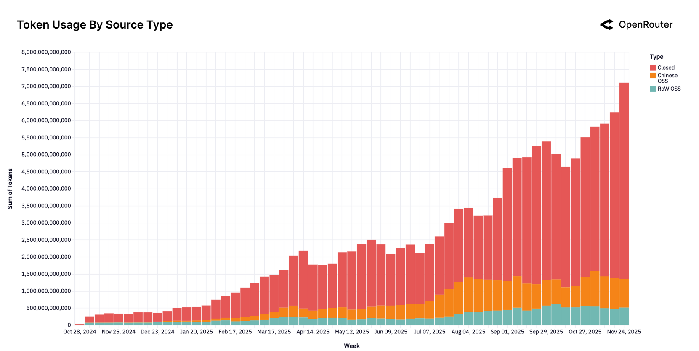
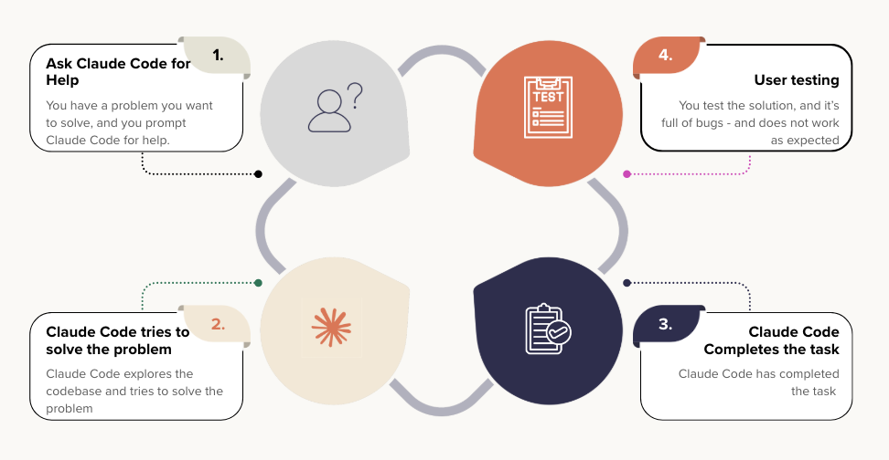

## Introduction

This year started with bold predictions. Sam Altman, in his January blog post "reflections," predicted 2025 would see the first AI agents join the workforce and materially change company output. As we come to a close of this year, the word "agent" has indeed become industry standard.

In this blog post, I want to provide a holistic review of the progress that has been made in the "agentic" space and also share my personal experience on how it's like in this changing industry. I have spent the year building production-grade AI agent systems - including single and multi-agent systems via Orchestration. I have noticed a big difference in the tooling, mindset & approach to building AI agent systems since the start of the year to now.

**2025 was the year AI agents went mainstream.** Not as a buzzword, but as actual production systems generating positive ROI. Coding has been the first practice to change. We went from tab-completions to fully dedicated coding assistants.

In this post, I'm sharing what I've learned this year: the seismic shift in how developers have adopted coding assistants, the rise of agent engineering as a discipline, the hard truth about reliability, and why fine-tuning matters more than we thought. 

Below, I'm sharing insights and data from two very recent surveys that substantiate this shift we're seeing in 2025:

Some of the key insights from a recent survey on the **use of AI agents in production** [@pan2025measuringagentsproduction]:

- *72.7% of practitioners use agents for "increasing productivity"*. This refers to increasing speed of task completion over the previous non-agentic system. 63.6% for reducing human hours, and 50% for automating routine labour.
- *Reliability remains the top development challenge.*
- *Latency impacts only 15% of applications as a deployment blocker.*
- *93% of AI agent systems serve humans, rather than other agents or systems.*
- *70% of the practitioners use off-the-shelf models, relying on "Prompting" rather than fine-tuning for optimization!*
- *Only 3 of the 20 deployed solutions use open-source models.*

:::: {.callout-note}
These survey results closely mirror what I’ve seen in production. Reliability is definitely a challenge but not impossible to get especially now with the models getting better & better at instruction following.

As a rule of thumb, I believe that reliability as a challenge is directly proportional to the complexity of the AI agent system. In other words, the simpler the agent, the easier it is to reliably operate. More on ways of improving reliability later in this blog post.

Aside, my experience also aligns with the preference for proprietary models such as GPT-5 and Claude when building production-grade AI agents. Open-source models like DeepSeek v3.2 [@deepseekai2025deepseekv32] have made strides, but I've found they still struggle to follow instructions with the same precision and often have difficulties with reliable tool calling compared to their proprietary counterparts especially over longer conversations.

On fine-tuning: the 70% stat doesn't tell the full story. Yes, off-the-shelf models work great for general-purpose agent tasks. I haven't needed to fine-tune for my work. But fine-tuning becomes essential when you're building a product with vertical appetite: solving a specific domain problem or serving a niche market. Companies like Checkr, Shopify, and Vercel have proven that specialized fine-tuning delivers 10-15x better results at a fraction of the cost of general models. Fine-tuning isn't declining; it's moving upstream to product-specific layers.
::::

Next, below, I share results and trends from another report - the State of AI report from OpenRouter, [@openrouter2025stateofai]: 

{#fig-2}

The main highlights from this report that best relate with my experience are:

- *Open-source to closed-source split has remained steady throughout the year with open-source adoption at around 20-30% for all inference calls.*
- *Reasoning based models are becoming the default path for production workloads*
- *50% of all OSS queries are for "roleplay"*
- *Bulk of the coding queries (~80%) are handled via proprietary models and only ~20% via OSS.*
- *As of Nov 2025, `claude-sonnet-4.5` is the most commonly used model with tool-call invocations (or as the report calls it, agentic inference)*
- *Average token length has grown nearly 4X since early 2024 to date with programming (coding assistants) as the main driver behind token growth*
- ***50% of all requests are for programming** (used to be 11% from a year ago). Anthropic has the dominant share at 60% of all coding requests.*

:::: {.callout-note}
> **50% of all requests are for programming**

This is a crucial shift in daily developer workflows. I dive deeper into @sec-coding-assistants with my perspective on these changes and their impact on how we work.
::::

:::: {.callout-note}
OpenAI's `o1` series helped popularize a different way of doing inference: letting models spend extra “thinking” tokens on internal reasoning before answering. The industry went from explicit "Chain of Thought" to implicit "Chain of Thought" via thinking/reasoning tokens! APIs often provide thinking budgets as an option to users - low, medium & high. Generally speaking, "medium" is the sweet spot taking latency and response time into consideration.

On tool call invocation, it is a bit surprising to me that `claude-sonnet-4.5` is the most widely used model with tool call invocation. In my experience, I have noticed `gpt-5` series to be far ahead at agentic applications that require tool calling.

Also, average token length increase is not a surprise, as the industry moves towards more AI-assisted development. With LLMs now accepting complete files from codebases as inputs and rewriting files from scratch, the token count increase makes sense!
::::

The statistics tell one story. But they don't capture what it actually feels like to code in 2025. Let me show you what's really changed.

## Coding Assistants / Terminal Agents {#sec-coding-assistants}

A typical day in an engineer's role has completely changed in 2025! This year has brought about a BIG shift to the way engineers (including myself) write code! 

See the below figure from [@openrouter2025stateofai]. 

{#fig-1}

As is notable from @fig-1, programming has surged from 11% to 50% of all AI requests throughout the year.

That's not it. A new category of coding assistants (SimonW called it "Terminal Agents" [@willison2025terminalagents]) has emerged such as Claude Code, Gemini CLI & Codex!

Most of the developer time is spent on reviewing AI-generated code. Repetitive tasks have been offloaded. Entire test suites are now AI-generated. 

> Personally, I am a Claude Code power user. I hardly have to write handwritten code anymore. Opus 4.5 combined with the Claude Code harness - it's like driving a Ferrari, which gets me to my destination faster. But, there's a catch!

A question we should ask ourselves - are these coding assistants helping us to be better developers? **In the long run, are we really winning?**

<blockquote class="twitter-tweet" align="center">
My biggest worries about coding with AI:  1. Beginners not actually learning 2. Atrophy of skills  I’m seeing #1 happen and I don’t have a good answer yet.   Leveling up as an engineer requires grinding and it’s not always fun. If AI can solve most of the problems for you, when…
&mdash; Lee Robinson (@leerob) <a href="https://twitter.com/leerob/status/1996281383535382909?ref_src=twsrc%5Etfw">December 3, 2025</a></blockquote> 

Above Lee Robinson raises two extremely valid points that are a concern to me too:

1. Beginners not actually learning 
2. Atrophy of Skills

In the following sections of this blog post, I would like to deep dive into both of these topics. But first, why do I care so much about beginners not learning? Simple - at many tasks and technologies, I'm a beginner too!

### Beginners not actually learning

I was recently having a chat with a friend of mine, who is not a developer by profession. However, he is a brilliant & creative mind. The availability of coding assistants such as Claude Code/Codex and IDE's such as Cursor/Cline has allowed him to work on prototyping his ideas - and also releasing applications to the wider public! This can often lead to monetary outcome with real world consumers.

Given he is not a developer, he often does not fully understand the code that is written by these coding assistants, at this point he is faced with two options:

- Hard road: Actually invest the time to understand what the AI wrote and why it works (or doesn't)
- Easy road: Trust the code works and keep shipping

This might be a good moment to pause and reflect on which road would you take? 

The answer varies on multiple factors:

1. **Time** - If you need to ship fast, you'll probably keep "vibe-coding" - trusting the models to do their
job and write quality code without questioning much.
2. **Stakes** - Is this going to impact real users? How badly could things break? The higher the stakes, the
more you need to actually understand what's being shipped before it hits production.
3. **Motivation** - What truly drives you? Are you outcomes-focused, just trying to get things done? Or do you
  value the learning journey over the final result? 

My take? If your goal is to get better at your craft, don't use coding assistants while learning. And if you do, understand every single line of code.

I put this to the test this year. When learning a new programming language, I did not rely on coding assistants at all - just used tab completion sometimes. I deliberately picked the hard road. It was frustrating and slow, but I actually learned the language instead of just shipping code I didn't understand. Worth it. 

{#fig-3}

::: {.callout-note}
Notice the pattern? Without understanding the generated code, you're not debugging - you're just prompting again and hoping for better results. Each iteration keeps you dependent rather than building your skills.
:::

Now, let's look at the other side of the coin - at experienced developers who have been writing code and software for a while.

### Atrophy of Skills

The more I depend on Claude Code, the less I code from scratch. What happens to my skills in the long run?

My workflow has changed dramatically. I no longer search [Stack Overflow](https://stackoverflow.com/questions) for answers. Instead, after careful planning, I rely on my coding assistant to complete tasks, review its code, provide feedback, and iterate until I'm happy with the result. 

A year ago, I was writing 80-90% of code from scratch, besides tab-completions. Now? Maybe 10-20%. Does this make me a better coder or worse?

Quoting [Lee's Tweet](https://x.com/leerob/status/1996281383535382909) again:

> For #2, I’m definitely paranoid about this for myself. What will it feel like to build software in 5 years? Will I have forgotten someone of the skills I used to rely on? Maybe that won’t even matter because we will truly be operating at a higher level of abstraction. Even if that pans out, it’s always been important to deeply understand the systems/dependencies you’re building on.

I believe the skepticism that has been mentioned is this: speed and productivity come at the cost of deep understanding. 

With this, I disagree. Just this year, I've grown tremendously as a software developer while having more time to read research papers. Not having to write every line from scratch has freed me to focus on system design, understand design patterns in different libraries, and contribute to product in programming languages I hadn't used before.

I believe, in future as well, I will continue to have a deep understanding because I review every line of AI-generated code, understand the tradeoff and make architectural decisions. That's where the deep understanding lives. 

This tooling represents another layer of abstraction that we as developers will be operating it, but is still upto the developer to go as deep as they'd like.

#POINTER: Fix grammar "we as developers will be operating it" → "we as developers will be operating on it" or rephrase for clarity (e.g., "will operate within" or "will interact with").

## On the rise of Agent Engineering: A New Discipline

2025 has given rise to a new kind of discipline - Agent Engineering. [@langchain2025agentengineering].

To me agent engineering is the subtle art of building production grade AI Agents. The success of any "agent" hinges on following levers:

1. **System Prompt:** The agent's guide/playbook on exactly how to respond in various situations. To me this has to be one of the biggest differentiators in agents that work, and agents that don't.
2. **Model:** Generally speaking, for more complex agents, proprietary models such as `gpt-5` and `claude-sonnet-4.5` work better and score higher on evaluation metrics.
3. **Tool calling (& Latency):** How well defined are your tools? Remember, any LLM API only sees the JSON schema of the tool, so having high quality definitions and sometimes even a "how to use" section in the tool description makes a big difference. In terms of latency, this is more for User Experience - if a tool is taking too long, can it be broken down into multiple tools?
4. **Error Handling:** As an agent engineer, you should be very careful with what errors get raised and the retry logic on the AI Agent. Raising smart error messages with carefully engineered try-except blocks will allow the agent to self-heal and self-correct its path if it has happened to go down the wrong road. 
5. **Agent Architecture (Tool schemas, Agent Interface):** This matters a lot as you scale. A good example of a nicely architected agent would be Manus. Rather than building a multi-agent system, Manus architected the agent as a single agent system with multiple tools. [@ji2025contextengineeringmanus]
6. **Agent Context/History (or now more commonly referred to as "Context Engineering"):** Context engineering matters especially when conversation history lengths explode. When working with multiple tools or subagents, it is critical as what goes on and what goes out to the LLM API (that powers the agent). Being too verbose could mean that the agent could be distracted, being too succinct, could lead to diminishing quality outputs.
7. **Evaluation & real-time Monitoring:** As you build the agent, it is important and critical to first test it on multiple use-cases and also monitor its performance as it is being used by customers. Measuring high quality "domain metrics" that directly align with the product's success would often lead to a good sense of direction for future versions of the agent and no surprises when a customer says "X feature is not working".

## On Reliability of AI Agents in Production

What about reliability? How do you know the agents have been working well in production. I refer to this as realtime performance monitoring. Speaking from experience, there are multiple ways to go about achieving this:

1. **Have dedicated dashboard for tool call accuracy:** Mostly, tools also involve API calls to other APIs. What if those APIs are down? In that case the tool fails, and the agent moves on to try another tool - affecting the overall reliability of the agent. This is a silent failure as opposed to the error in agent runtime. Having dashboards and metrics on success rates of each tool helps in maintenance and observability of ongoing agent performance.
2. **Raise alerts in appropriate slack channels:**  Raising errors in Slack is often better for visibility than searching logs. Having dedicated channels helps in this endeavour and towards long term monitoring of agent performance.
3. **Use policy models such as `gpt-oss-safeguard` to log metrics on policy breaches:** So far, we have only monitored quantity via success metrics. But what about cases when the model fails to follow its guidelines? What if we, as developers, wish for the agent to perform a task, but it does completely the opposite? In this case, having policy models review agent actions and raising alerts on violations is a really healthy practice. This practice can also be coupled with guardrails - which is more commonly for realtime monitoring of agent responses for PII, NSFW content.
4. **Dedicated list of domain specific test cases that run as part of CI/CD every day or every few hours to monitor for regression:** This goes back to the idea of integration tests. Having dedicated tests that run as part of CI/CD on a daily basis and a quick glance on the results help with sanity check and making sure the agent performance is not regressing. 
5. **Well planned A/B tests:** Rolling out newer system prompts feature flagged via a service helps perform A/B tests and measure change in metrics prior to rolling out to all users. This is especially useful when changing API vendors, system prompt updates or in general before changing the agent architecture of production agents.
6. **Continue to monitor production metrics that matter such as DAUs (daily active users), retention rates:** We should continue to monitor real business metrics to be able to measure ROI on AI agent development and deployment. Every agent running in production incurs costs, and business metrics are a great way to see if the "costs are worth it". As an example: After deployment of a customer support agent, has my NPS improved and by how much?
7. **Well placed try-except blocks with intelligent error messages for implicit self-healing capabilities of Models:** Having more intelligible error responses with call to action on how to self-heal allows the agent to recover quickly and try a different path as per the error instructions. Example, if SerpAPI for google search is down, maybe you can raise an error for the agent to try Exa instead.

## When Fine-Tuning Matters: Building Vertical-Specific Products

Fine-tuning matters when your product has an appetite for it: when you're solving a vertical problem or serving a niche market.

1. **Q Programming Language** [@qprogramminglanguage2025]: Fine-tuned 1.5B model outperforms Claude Opus by 29.5% on Q tasks. Domain-specific pretraining + SFT + RL overcomes lack of internet data for niche language.

2. **Vercel v0** [@vercel2025v0composite]: Fine-tuned models achieve 93.87% error-free code generation vs Claude Opus at 78.43% and Sonnet at 64.71%. Custom `vercel-autofixer-01` handles error-correction during streaming via RL fine-tuning, isolating concerns while allowing base model upgrades independently.

3. **Shopify** [@shopify2025multimodal]: Fine-tuned open-source multimodal models (LLaVA, LLaMA, Qwen2VL) for product categorization. Multi-task training + selective field extraction reduced latency from 2s to 500ms, processing 40M daily inferences.

4. **Checkr** [@checkr2025finetuning]: Fine-tuned LLaMA 2-7B achieved 97.2% accuracy at <$800/month vs GPT-4 at $12,000/month for complex categorization.

5. **Datadog** [@datadog2025nlqueries]: Built natural language querying features (text-to-SQL variant) using fine-tuned models, replacing prompted OpenAI models. Fine-tuning enabled <500ms latency and cost efficiency by running on their own pay-per-hour GPUs, delivering tab-completion-like UX.

What these case studies have in common: each company had a specific problem, deep domain expertise, and the infrastructure to support fine-tuning at scale. Vercel didn't fine-tune because it was trendy. They fine-tuned because generating error-free code at scale required it. Checkr didn't invest in fine-tuning for general purpose tasks; they did it because background check categorization had clear success metrics and massive volume. This is the pattern. Fine-tuning works when you're not solving generic problems but rather building products with an appetite for it.

## Conclusion

2025 was unmistakably the year AI agents moved from POCs to real world products. Not as a hypothesis to test, but as working infrastructure generating measurable ROI. The shift was so comprehensive that it touched every aspect of how we build software.

If I had to summarize what I've learned this year: **AI systems that work in production are systems that are carefully engineered, closely monitored, and built for their specific use case.** The magic isn't in the model. It's in everything else.

2026 will bring better models & cheaper compute. But the fundamentals won't change. Build good systems. Measure what matters. Fix what breaks.