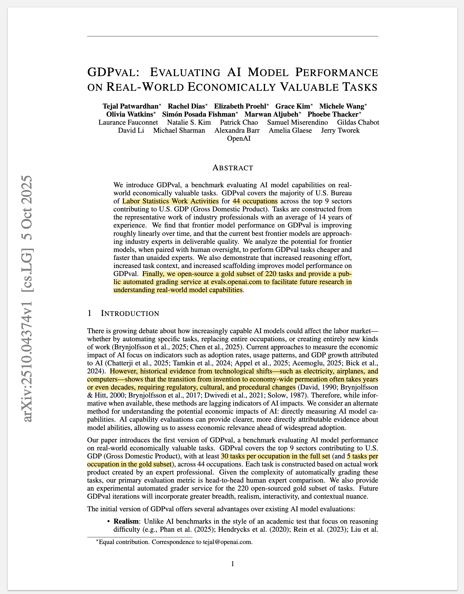
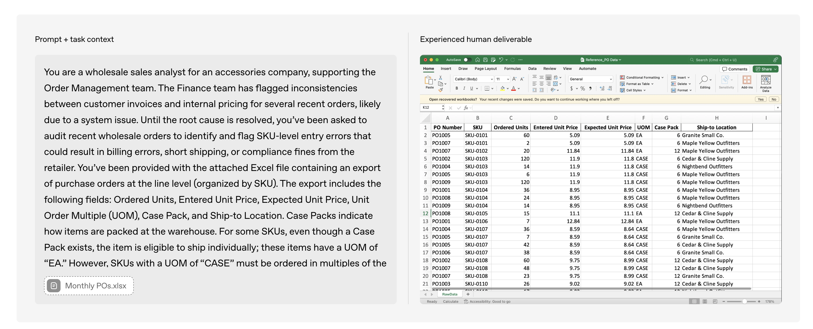
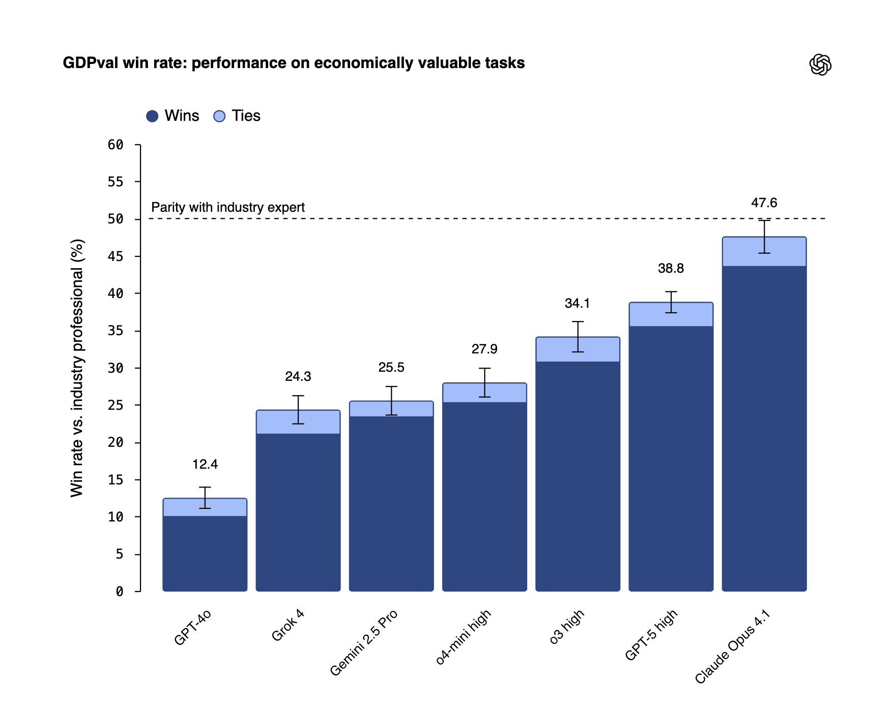
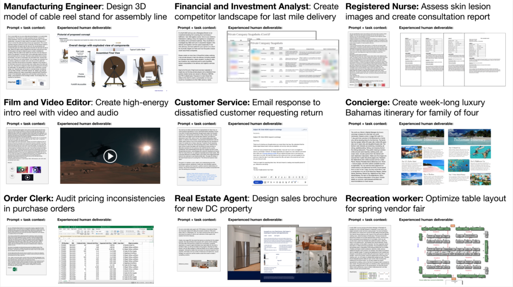
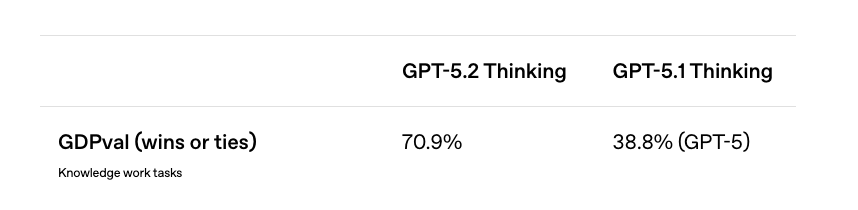

{#fig-1 height="750px"}

## Introduction
Recently OpenAI team has released a new benchmark called **GDPVal** [@gdpval2025]. This benchmark tests AI Model performance on tasks from 44 occupations spread across 9 sectors that contribute the maximum towards US's GDP. The benchmark consists of a total of 1,320 tasks of which 220 have been open-sourced available via Huggingface.

{#fig-2}

Each task consists of a prompt & task context and reference files. An agent harness using various models such as `claude-opus-4.1`, `gpt-5`, `o3-high` is then run on each task to get a final output, and win rate is measured by competing each output head to head with each other resulting with an industry professional's output as the baseline. Overall, at the time of release of benchmark - `claude-opus-4.1` has the highest win rate at 47.6% against the industry professional.

{#fig-3}

The GDPVal benchmark is one of the most crucial benchmarks as a measure for real-world AI model performance and its ability to automate specific tasks, replace entire occupations, or create entirely new kinds of work. Since the tasks are spread across various economically valuable sectors and occupations, it provides a holistic review of model performance as compared to mostly other benchmarks which focus on specific tasks.

However, there are a couple challenges in replicating this benchmark:

1. **The complete benchmark has not been open-sourced:** Only 220 of the total 1,320 tasks have been open-sourced and made publicly available. This makes it hard to study the complete benchmark and analyze any biases present in the database.
2. **The agent harness is not open-source:** The agent harness used to complete the tasks has not been publicly shared making it very hard to reproduce. Parts of the harness, such as an edited version of the system prompt has been made available in the paper [@gdpval2025], but not the complete harness. 
3. **Open source models missing from the comparison results:** Open source models such as DeepSeek, Qwen, Olmo, Llama, Kimi-K2 are missing from the benchmark results and comparison. //TODO: Add references

As part of this blog post, I recreated the agent harness and am sharing the code and results at [github.com/amaarora/GDPVal](https://github.com/amaarora/GDPVal). The harness is built using [SmolAgents](https://github.com/huggingface/smolagents) and includes results on the publicly available benchmark of 220 tasks. I also expand the benchmark results to include open-source models and results via Claude Code as the agent harness.

## Exploring the GDPVal dataset

In this section, let's look at a couple sample tasks in detail. 

### Task 1: Anti-Financial Crime Risk Audit (Accountants & Auditors)
To further understand the dataset, let's deep dive into the first task.

```{python}
#| code-fold: true
#| code-summary: "Read tasks dataset"

import pandas as pd
from pathlib import Path

DATA_DIR = '../../GDPVal/dataset'
df = pd.read_parquet(DATA_DIR + "/data/train-00000-of-00001.parquet")
df.shape
```


Now, having read the tasks dataset, let's start exploring the first task. We will start by looking at the sector and occupation that this task is from.


```{python}
#| code-fold: true
#| code-summary: "Exploring first task's sector and occupation"

df.sector[0], df.occupation[0]
```

Ok, so now we know the task is from sector - **'Professional, Scientific, and Technical Services'** belonging to **'Accountants and Auditors'** occupation. Let's also read the accompanying prompt and reference files available.

```{python}
#| code-fold: true
#| code-summary: "Read first task's prompt and its reference files"
print(df.prompt[0]) 
df.reference_files[0]
```

So the task requires an auditor to analyze Anti-Financial Crime Risk Metrics, select a representative sample based on specific risk criteria, and deliver the results in a new spreadsheet titled 'Sample' with supporting workings. The key question that GDPVal benchmark tries to answer: **"Can this task be automated and to what accuracy?"**

Let's dig a bit deeper into the provided spreadsheet as well.

```{python}
#| code-fold: true
#| code-summary: "Preview first task's reference file"
import os

reference_fpath = (DATA_DIR + "/" + df.reference_files[0][0])
reference_df = pd.read_excel(reference_fpath)
reference_df.head()
```

Above is the `Population` spreadsheet - the dataset that serves as the population for audit testing. Let me break down what each column represents:

- **No, Division, Sub-Division**: The organizational hierarchy within the bank (e.g., AM = Asset Management)
- **Country, Legal Entity**: Geographic location and the specific legal entity reporting the metric
- **Metric Code** (A1, A2, C1, etc.): Standardized identifiers for different Anti-Financial Crime Risk Metrics
- **Metric Name**: Human-readable description of what each metric measures (e.g., "Number of clients", "Revenue for business")
- **Q3 2024 & Q2 2024 Metric Values**: The reported values for each quarter that the auditor must verify

Looking at the sample data shown, we can see metrics from Asset Management division across Australian entities. Some metrics have values (like A1 with 22-23 clients), while others show zeros (A3, A4, C1). These zeros are particularly interesting for auditors - they could represent legitimate zero activity or potential data quality issues that warrant investigation.

The auditor's challenge is to efficiently and accurately test this entire population of metrics to ensure reported values are complete and accurate.

### Task 2: IEM System Design (Audio & Video Technicians)

Let's also look at the another task in the same detail as we did with the first one. We start with the sector and occupation. I chose arbitrary index as 10.

```{python}
#| code-fold: true
#| code-summary: "Exploring second task's sector and occupation"

df.sector[10], df.occupation[10]
```
This time, we have the sector as 'Information' and the occupation as 'Audio and Video Technicians'.

Let's look at the prompt & reference files.

```{python}
#| code-fold: true
#| code-summary: "Read second task's prompt and its reference files"
print(df.prompt[10])
df.reference_files[10]
```

The task requires an Audio and Video Technician to design and source a complete, portable in-ear monitor system for a touring band, and deliver a PDF proposal including equipment selection with product links, wiring diagrams, and a detailed cost breakdown - all within a $3,000 budget.

Also, there are no reference files for this task.

Overall, this tasks dives into budgeting capabilities of the model. To perform well in this task, the model must have good domain knowledge of Audio & Video Technician's equipment requirement and also be able to budget it within $3000 budget. It is possible that models might hallucinate for this task.

### Task 3: Parenting Program Curriculum Design (Home Visitors) 

Let's also review another task. I am taking index 21 as another random task. Let's start with the sector and occupation as before. 

> Ideally, I should have just written a simple "explore_task" function that accepts an index and returns occupation, sector, prompt and so on. But as part of this blog post, I think its okay to focus on each task and add commentary and not focus on writing efficient code.

```{python}
#| code-fold: true
#| code-summary: "Exploring third task's sector and occupation"

df.sector[21], df.occupation[21]
```

Interesting, we are now looking at a task from sector - 'Government' with occupation 'Child, Family, and School Social Workers'.

Let's look at the prompt and reference files provided (if any).


```{python}
#| code-fold: true
#| code-summary: "Read third task's prompt and its reference files"
print(df.prompt[21])
df.reference_files[21]
```

The task requires a Home Visitor to design two accessible and visually engaging PowerPoint presentations for Sessions 13 and 14 of a Nurturing Parenting Program for families in substance abuse recovery, following the program manual and supporting parent reunification goals. 

Again, no reference files but the success of this task would depend on web navigation, to read the content required for delivery of Sessions 13 & 14, and be able to distill that information as a Powerpoint presentation.

### Task 4: Robot Fleet Data Management API (Software Developers)

Let's look at another task in detail, and this one will be the last one as part of our exploration. Taking index 219 (or the last task) as the random task to explore.

```{python}
#| code-fold: true
#| code-summary: "Exploring fourth task's sector and occupation"

df.sector[219], df.occupation[219]
```

We are now in a sector similar to mine - 'Professional, Scientific, and Technical Services' and the occupation - 'Software Developers'. Without looking at the prompt, my prediction is that most models are able to write good quality code. 

Let's explore the prompt and reference files now.


```{python}
#| code-fold: true
#| code-summary: "Read fourth task's prompt and its reference files"
print(df.prompt[219])
df.reference_files[219]
```

The task requires a Software Developer to design a scalable API and data pipeline for managing robot fleet data uploads, prioritizing real-time customer-facing insight data while handling resumable transfers, variable sensor configurations, and efficient cloud processing.

There is also one reference file, and it looks like an architecture diagram. Let's preview it.


```{python}
#| code-fold: true
#| code-summary: "Preview fourth task's reference file"
from PIL import Image

reference_fpath = (DATA_DIR + "/" + df.reference_files[219][0])
Image.open(reference_fpath)

```

The architecture diagram reveals a carefully thought-out data pipeline with clear priorities. Here's what the system design shows:

- **Insight Data Path (Priority)** - Customer-facing data streams directly to Regional Cloud Storage with CDN and replication enabled, ensuring low latency and high availability for revenue-generating insights
- **Payload Data Path (Bulk)** - Training and MLOps data takes a separate bulk upload path, allowing for less frequent transfers and potentially SSD shipping as mentioned in the task requirements
- **Regional Cloud Storage** - Acts as the central hub, receiving both data types and coordinating with the cloud for processing and syncing
- **Data Processing Pipeline** - Downstream processing includes Ingest, Decode & Feature Extraction, and Dashboard Storage, allowing the system to transform raw robot data into actionable insights
- **Metadata Indexing** - Tracks upload status and enables the system to handle partial/resumable uploads from multiple robots

The developer's challenge is designing an API that orchestrates this entire workflow while gracefully handling network failures, resumable transfers, and the variability of different robot types and mission completions across a globally deployed fleet.

### More Tasks from GDPVal

The paper also provided a sample of example tasks as in the figure below.

{#fig-4}

As can be seen from @fig-4, the tasks include - image creation, consultant report generation, designing sales brochure, video creation & also planning a luxury holiday in the Bahamas!

The dataset includes a wide variety of tasks - each representing a real world task performed by an industry professional. 

## Model Performance Comparison on GDPVal dataset

During the first release of the benchmark, as is shown in @fig-3, Claude Opus 4.1 was the best performing model with a 47.6% win rate against an industry professional! What this means is that 47.6% of the time, the model's output was preferred as against to that of an industry professional! 

However, 3 days ago, when OpenAI GPT 5.2 was released, the win rate of GPT 5.2 Thinking on this benchmark is at an astonishing 70.9%! [@gpt52]

{#fig-5}

This is a massive leap forward, having looked at the tasks - we know that these are real tasks performed by industry professionals with decades of experience. In fact, from the GDPVal research paper [@gdpval2025],

*Tasks are constructed from the representative work of industry professionals with an average of 14 years of experience.*

The tasks are constructed by representatives with an average of **14 years of experience**! And now, with the release of GPT 5.2, we have a model that outperforms these industry professionals 70.9% of the time?!

> With Claude Code as a harness accompanied with Skills, I imagine that the win rate percentage could be even higher. As part of this blog post, I am going to explore how the outputs look like for the golden set with Claude Code as the agent harness.

::: {.callout-note}
## What does 70.9% performance really tell us?
As I explore the GDPVal paper while writing this blog post, I find myself with some compelling questions. GPT 5.2's ability to match or exceed industry professional outputs 70.9% of the time across 44 occupations spanning 9 key GDP sectors is genuinely impressive - but it raises interesting questions worth considering. What distinguishes the remaining 29.1% where professionals still have the edge? 

The model performance is only going to get better every year. Today, in 2025, the ways of working for a developer have changed completely with the introduction of coding assistants. Are these industries next?
:::

## Replicating results using a naive agent harness

Before we get into replicating the tasks with an agent harness, that is with an agent and tool use, it is important to think about how to measure success. In the paper [@gdpval2025], the authors chose cost & time as the key dimensions for evaluation.

1. **Cost Improvement $H_C$:** On average, for the gold set of 220 tasks released, it costs **$361** for industry professionals to complete the task. Can the models complete the same tasks for cheaper? And if so, by how much?
2. **Time Taken $H_T$:** On average, it takes **404 minutes** for an industry professional to complete the task. 

Similar metrics - $M_C$ & $M_T$ could be calculated for various models, and time gains are then calculated as $\frac{H_T}{M_T}$ and analogously for cost $\frac{H_C}{M_C}$.

> *From Table-2 in the paper [@gdpval2025], `gpt-5` is at 90x speed improvement and 474x cost improvement with 39% win rate.*

::: {.callout-important}
## Limiting Scope for the Agent Harness (in favour of time)

Since I did not want to spend days on creating an agent harness that works for all tasks, I have limited the scope for the project. We will be using [SmolAgents](https://github.com/huggingface/smolagents) to explore and build the agent harness. Here is the cut down scope:

- Focus only on tasks that require output formats as PDF, XLSX, Docx 
- Limit project to randomly selected 25 tasks instead of 220 in the golden set 
- At most 2 reference files attached
:::

To replicate results, I created a simple agent harness using SmolAgents which you can find in this repository - [https://github.com/amaarora/GDPVal](https://github.com/amaarora/GDPVal).

Mind you, it is a simple harness with default tools available and agent has instructions on how to output files in PDF, XLSX, Docx format and also create PNGs. To limit the scope, I only re-ran the tasks for `claude-haiku-4.5`, `gpt-5-mini`, `gpt-5.2`, `qwen3-next-80b` and also I used Claude Code as the agent harness to complete the task. 

::: {.callout-note}
I kept running into rate limit errors when using Opus 4.5. However, with the harness that I have shared you can easily run the tasks again by simply running `python src/smolagents-harness/run_agent_harness.py --model anthropic/claude-opus-4-5-20251101 --start 0 --end 9`

```
Retrying completion in 223.51326317058073 seconds as it raised RateLimitError: litellm.RateLimitError: AnthropicException - {"type":"error","error":{"type":"rate_limit_error","message":"This request would exceed the rate limit for your organization (187431d4-2674-4345-8a63-1c590dc656cc) of 30,000 input tokens per minute. For details, refer to: https://docs.claude.com/en/api/rate-limits. You can see the response headers for current usage. Please reduce the prompt length or the maximum tokens requested, or try again later. You may also contact sales at https://www.anthropic.com/contact-sales to discuss your options for a rate limit increase."},"request_id":"req_011CW85QQWdhub2ry5pWU88u"}.
```
:::

## Comparing results from various models & Claude Code as the agent harness

Since I have re-run a version of my own agent harness on some sample tasks, we can easily compare the outputs to get a sense of model performance for various models across the tasks.


### Task Results: Elder Financial Exploitation Training (Customer Service Representatives)

We will focusing on the first task in the sample set.

```{python}
#| code-fold: true
#| code-summary: "Load sample task data"
sample_fpath = (DATA_DIR + "/data/task_data.parquet")
df = pd.read_parquet(sample_fpath)
df.shape
```

Let's read the prompt and task data to understand more before we look at the results from various models.


```{python}
#| code-fold: true
#| code-summary: "Read elder exploitation task details"

print(df.prompt[0])
df.task_id[0], df.reference_files[0], df.sector[0], df.occupation[0]
```

A Senior Customer Service Representative must create a practical 10-page training PDF and a second PDF with three mock accounts showing red flags for elder financial exploitation, helping team members identify and escalate concerns based on Senior Safe Act and FINRA Rule 2165 protections.

Here is the supporting information provided as part of the task.

<iframe src="https://www.finra.org/sites/default/files/2019-05/senior_safe_act_factsheet.pdf" width="100%" height="600px" style="border: 1px solid #ccc;"></iframe>

#### Model Outputs Comparison

Now let's compare how different models performed on this task. Below are the outputs from Claude Code, Claude Haiku 4.5, GPT-5 Mini, GPT-5.2, and Qwen-3-Next-80B.

::: {.panel-tabset}

## Claude Code

<iframe src="../outputs/claude-code-elder-abuse.pdf" width="100%" height="800px" style="border: 1px solid #ccc;"></iframe>

## Claude Haiku 4.5

<iframe src="../outputs/claude-haiku-4.5-elder-abuse.pdf" width="100%" height="800px" style="border: 1px solid #ccc;"></iframe>

## GPT-5 Mini

<iframe src="../outputs/gpt-5-mini-elder-abuse.pdf" width="100%" height="800px" style="border: 1px solid #ccc;"></iframe>

## GPT-5.2

<iframe src="../outputs/gpt-5.2-elder-abuse.pdf" width="100%" height="800px" style="border: 1px solid #ccc;"></iframe>

## Qwen-3-Next-80B

<iframe src="../outputs/qwen-3-next-80B-elder-abuse.pdf" width="100%" height="800px" style="border: 1px solid #ccc;"></iframe>

:::

All models successfully created both required PDFs (training deck and mock accounts), though we're only comparing the training materials above. The outputs show varying approaches: Claude Code and GPT-5.2 delivered detailed, workflow-focused guides with practical scripts optimized for real-world contact center use. Claude Haiku 4.5 produced well-structured training content with clear legal framework explanations. GPT-5 Mini emphasized concise, quick-reference formatting for rapid deployment. Qwen-3-Next-80B created minimal content, suggesting limitations in the agent harness's ability to execute complex document generation tasks.


### Task Results: Property Manager Weekly Schedule (Property Managers)

Let's look at the second task in the sample set and compare model outputs.


```{python}
#| code-fold: true
#| code-summary: "Preview second task details"

print(df.prompt[1])
df.task_id[1], df.reference_files[1], df.sector[1], df.occupation[1]
```

A Vice President of Operations must create a structured weekly schedule in table format (.docx) organizing Property Manager duties across time slots, activities, and monthly cycles based on the provided comprehensive task list.

Here is the reference file containing the detailed PM duties:

<iframe src="../outputs/pm-duties.pdf" width="100%" height="600px" style="border: 1px solid #ccc;"></iframe>

#### Property Manager Schedule Outputs

Below are the weekly schedule outputs from different models as downloadable Word documents. Note that Claude Haiku 4.5 did not complete this task.

- **Claude Code**: [Download PM Weekly Schedule](../outputs/claude-code-pm-schedule.docx)
- **GPT-5 Mini**: [Download Property Manager Weekly Schedule](../outputs/gpt-5-mini-pm-schedule.docx)
- **GPT-5.2**: [Download Property Manager Task Schedule](../outputs/gpt-5.2-pm-schedule.docx)
- **Qwen-3-Next-80B**: [Download Weekly Property Management Schedule](../outputs/qwen-3-next-80B-pm-schedule.docx)

GPT 5.2 is the clear winner here!

## Conclusion

As part of this blog post, I did a deep dive into the various tasks that are part of th GDPVal dataset shared by the OpenAI team.

With coding assistants such as Claude Code & Codex, it is really easy now to get started with any tasks. Agents are converging to have generic capabilities via an availability of bash, python executor, web search & scrape tools. With one simple prompt, I was able to get Claude Code to start working on the first 10 tasks.

Complete conversation with Claude Code is available here - [https://github.com/amaarora/GDPVal/blob/main/conversation.txt](https://github.com/amaarora/GDPVal/blob/main/conversation.txt).

To do an apples for apples comparison I also created an agent harness using SmolAgents, and re-ran some of the tasks to include Open Source models such as `Qwen3-next-80B`. In terms of output quality, both Claude Code & GPT5.2 have shown really high quality outputs with high instruction following capabilities.

If you enjoyed reading, consider subscribing to the blog for some special access! :)

Thank you for reading!

## References

::: {#refs}
:::