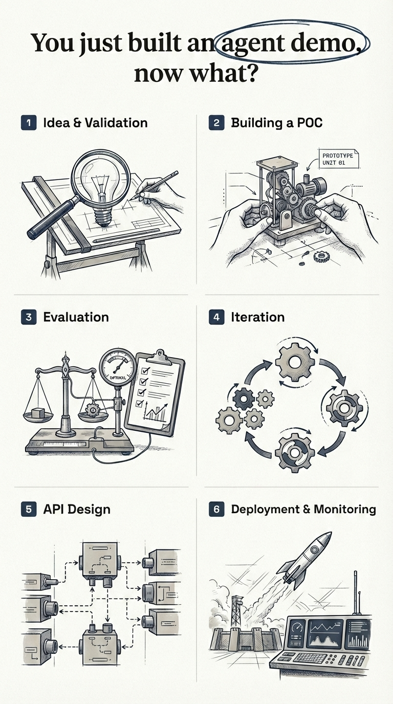
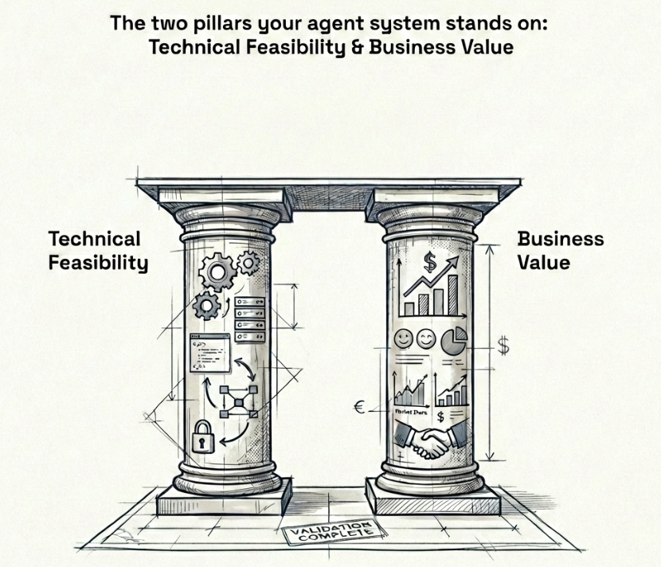
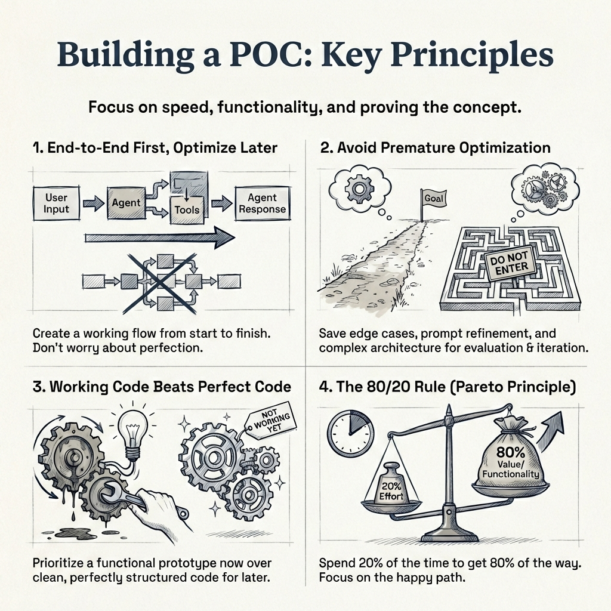
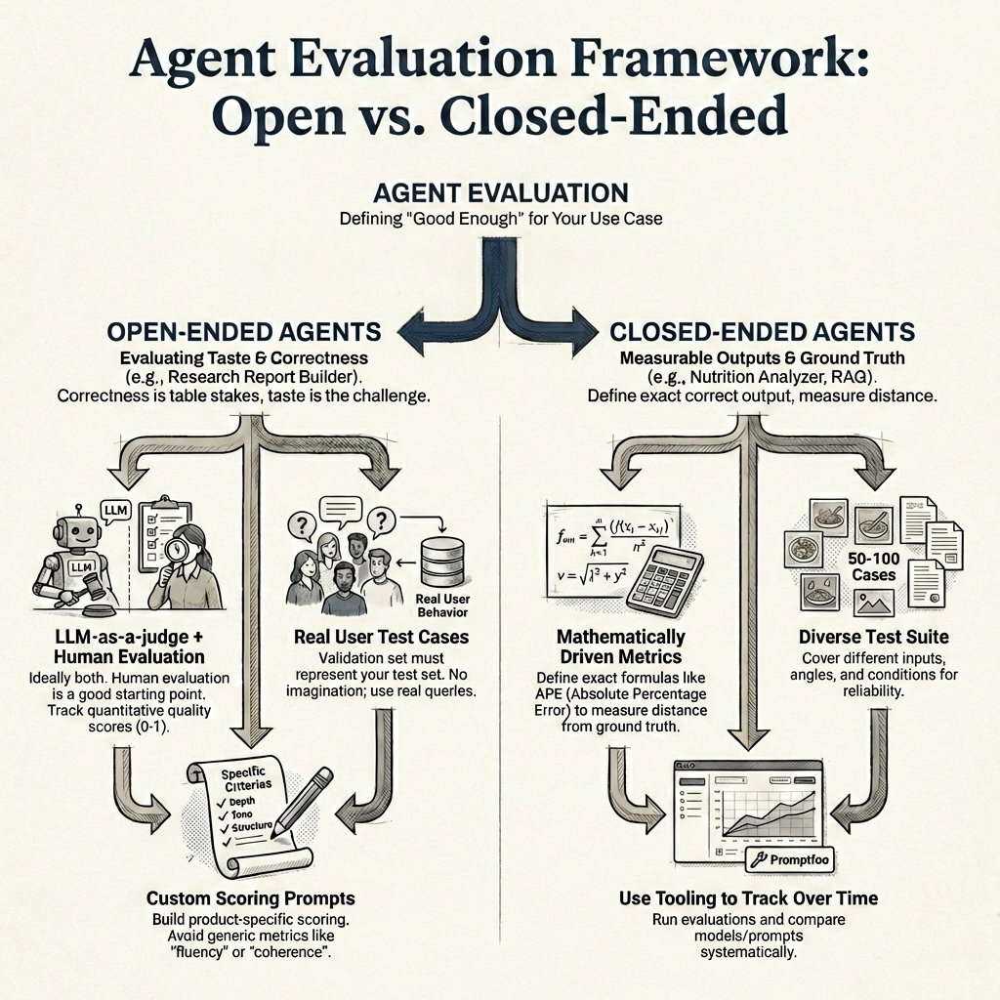
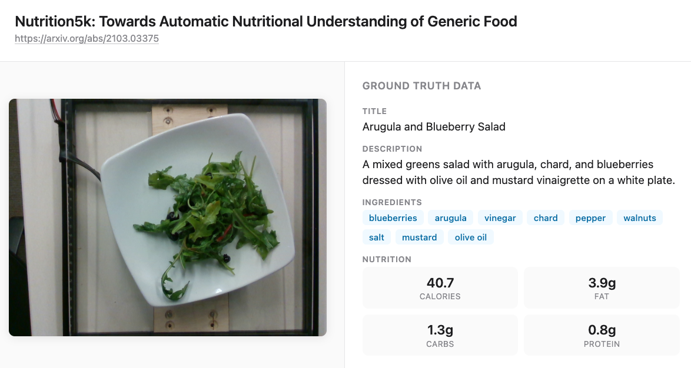
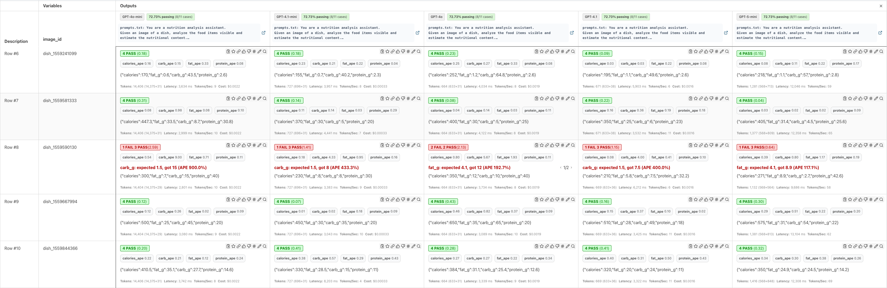
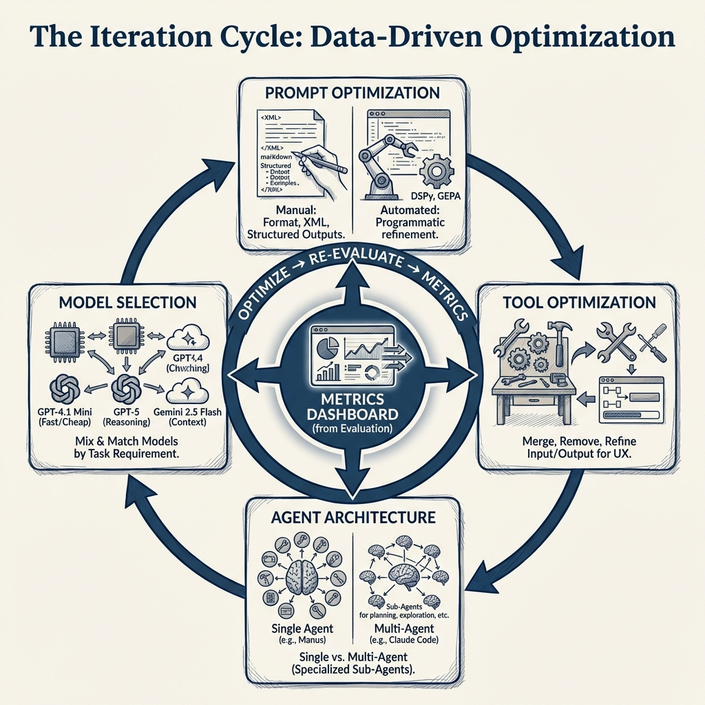

## Introduction

I would like to start this blog post with a simple question - **"You just built an agent demo, now what?"** The agent worked for the use case shown in the demo, and now you've been asked by your Senior Leadership to take it to production. What does that path to production really look like?

In the past year, I have built and shipped multiple AI agent systems to production. Every single time, the same pattern emerged - six stages between a working demo and a real product.

Here's my **TLDR:**

> The road from demo to production has six stages: (1) Idea & validation, (2) Building a POC, (3) Evaluation, (4) Iteration, (5) API design, and (6) Deployment & monitoring. You want to spend the most time in step 3 and step 4 - this is where your agent goes from a working demo to a world class product.

Here's what each stage involves:

1. **Idea & Validation** - Validate the idea technically and from a business perspective before writing any code
2. **Building a POC** - Build a fast, end-to-end prototype to prove the concept works
3. **Evaluation** - Define fine-grained, business-specific metrics and build a test suite
4. **Iteration** - Optimize prompts, tools, models, and architecture against your metrics
5. **API Design** - Package the agent as a stateless microservice with error handling and self-healing
6. **Deployment & Monitoring** - Ship to infrastructure with guardrails, alerts, and dashboards

{#fig-1 fig-align="center" width="60%"}

Let's start with the first stage.

## Idea & Validation

You have an idea for where an AI agent can solve a real problem - either for your customers or internally for your team. Before writing a single line of code, you need to validate this idea on two fronts: **technical feasibility** and **business value**. Think of these as the two pillars your agent system stands on - you cannot skip either. Remove one, and the whole thing falls.

{#fig-2 fig-align="center" width="60%"}

### Technical Validation

It is critical to know what agents can and cannot do today. Without this knowledge, you risk committing to building something that the technology simply cannot deliver yet.

Take **podcast generation** as an example. Today, industry standard voice APIs cannot generate [more than five minutes](https://elevenlabs.io/docs/overview/models#character-limits) of quality continuous audio in a single request. Let's say your grand idea is to automate the podcast creation process - you do the research, but you offload the audio creation to a voice AI API such as ElevenLabs. Today, we are just not there yet. The process is extremely cumbersome and it will cost you more time than it saves.

Or take **video generation** as another example. The maximum length of video that Google's Veo 3.1 [@veo31] can generate today is 8 seconds. If your agent needs to produce longer videos, you already know you will need to stitch multiple generations together - and that introduces its own set of challenges around consistency and continuity.

On the other hand, there are areas where agents genuinely excel today:

- **Code generation** - this is where LLMs truly shine. Products like [Lovable](https://lovable.dev/) and [V0](https://v0.dev/) would not exist without LLMs that can write production-quality code
- **RAG** (Retrieval-Augmented Generation) - grounding agent responses in your own data. I have seen RAG fail at many companies because they only relied on vector embedding search. Combining keyword search with vector embeddings through hybrid search significantly enhances retrieval quality - and good retrieval is what guarantees a good response
- **Research automation** - gathering, synthesizing, and summarizing information from multiple sources including web search and crawling. Products like Gemini Deep Research [@geminiDeepResearch] and OpenAI Deep Research [@openaiDeepResearch] are already proving this at scale
- **Slide and website generation** - turning structured content into polished presentations or landing pages. Since the output is mostly HTML or formatted code, LLMs can do a very decent job here
- **Voice calling with custom scripts** - agents that can make outbound calls and follow a conversation flow. Products like [Vapi](https://vapi.ai/) are leading this space

The goal of technical validation is simple - make sure that what you want to build is actually possible with today's technology before you invest any real time or money into it. If you do not have this expertise in-house, work closely with someone who does - an AI engineer or consultant who is hands-on with the latest models and tools and has experience shipping agents to production.

### Business Validation

Technical feasibility alone is not enough. You also need to validate that the idea has real business value. In my experience, the strongest business cases for agents come down to: **reducing costs**, **saving time**, **generating new revenue**, or **enhancing your product** - maybe it drives weekly active users up or increases retention rates. If your agent does not clearly do one of these, question whether it is worth building. Building an agent simply because "AI is the future" or because someone in leadership said so is not a strong enough reason.

At this point, you need to work closely with your product owner and answer some fundamental questions before writing any code:

- How is this agent going to integrate with the existing product?
- Where does the landing page sit? What is the entry point for the user?
- How is the user going to interact with this agent, and what is the expected outcome?
- Is it going to save the user time, reduce costs, help with onboarding, or direct them in the right way?
- What is the core problem this agent solves?

As a technical person, you might be able to answer some of these yourself - but most of the time, there is real value in working closely with someone who has strong domain expertise and understands product design well. Someone who has been in the field for five to ten years, who knows exactly what users need, and who has built successful products before.

Talk to your users. Validate the idea with them before going into the build phase. Understand what they actually need, not what you think they need. You want to mitigate risk early - not spend months building something only to realize the idea was never going to work.

## Building a POC

{#fig-3 fig-align="center" width="80%"}

So by now you have validated the idea - both technically and from a business perspective. Now you want to build a proof of concept as fast as possible to see whether your agent can actually solve the task you set out to solve.

The key principle here, and I cannot stress this enough:

> **Build end-to-end first, optimize later.**

You want a working flow from the first user message to the final agent response. It does not need to be pretty. Your code does not need to be perfectly structured. Your system prompt does not need to cover every edge case. You might have ten tools defined when you only need seven - that is fine. You are in the POC phase, and refinement comes later.

What does a POC look like in practice? At a minimum, you need:

- A **system prompt** that gives the agent its core instructions
- A set of **tools** that the agent can call to complete its task
- An **end-to-end flow** - from user input to agent output - that works for the primary use case

Whether you are building a research report generator, a text-to-SQL agent that runs BigQuery queries, a slides builder, or a general purpose agent like [Manus](https://manus.im/) - the goal is the same. Get to a working version that handles the happy path. If this agent went in front of a customer right now, it should work for roughly 80% of users. It will start failing on edge cases, and that is expected. **Edge cases are what the evaluation and iteration phases are for.**

Move fast in this phase. Use coding assistants to speed things up - there is no need to write every line of code by hand. Most popular libraries and APIs today support [llms.txt](https://llmstxt.org/) [@llmstxt], which makes it easy for any coding assistant to understand and implement against their documentation.

::: {.callout-note}
## What is llms.txt?
llms.txt [@llmstxt] is a proposed standard by Jeremy Howard for exposing a website's documentation in a format that LLMs can easily consume at inference time. Take [LangGraph's llms.txt](https://langchain-ai.github.io/langgraph/llms-full.txt) for example - it has all the documentation and code examples in one place so a coding assistant can read this single file and help you get started with the library immediately. It is faster onboarding and faster POC creation. I am not saying you should build your entire POC using coding assistants - but using them alongside llms.txt is a great way to speed things up.
:::

### What NOT to focus on during a POC

It is tempting to want to get everything right from the start. Resist that urge. In the POC phase, do not focus on:

- **Perfecting your system prompt** - it will evolve significantly during evaluation and iteration
- **Covering edge cases** - that is the job of the next two phases
- **Context window limits or compaction strategies** - premature optimization at this stage
- **Perfect code structure or architecture** - clean code matters later, working code matters now
- **Cost optimization** - you are validating the idea, not optimizing the bill

The reason you can afford to be quick here is that the evaluation and iteration phases exist specifically to refine everything you skip now. This is where the business will appreciate you - you have built a working POC quickly and demonstrated value in the idea. That buys you the time and trust to do the hard work of refinement in the next stages.

## Evaluation {#sec-evaluation}

{#fig-eval-framework fig-align="center" width="80%"}

So by now you have a working POC. The agent handles the happy path and works for roughly 80% of users. Now you need to figure out how to measure whether it is actually good enough - and what "good enough" even means for your specific use case.

A framework I have found useful is to split agents into two categories - **open-ended** and **closed-ended** - because the evaluation approach is fundamentally different for each.

An **open-ended** agent produces outputs where there is no single correct answer - think of a research report builder, or something like Gemini Deep Research [@geminiDeepResearch]. There are multiple valid ways to write the same report, with differences in tone, depth, structure, and information. A **closed-ended** agent, on the other hand, has outputs you can measure precisely - like a nutrition analyzer that returns macronutrient values, or a RAG agent where you can check whether the right chunks were retrieved.

### Evaluating open-ended agents

With open-ended agents, correctness is table stakes - the real challenge is **taste**. Think of a research report builder - a report on gold and silver prices over the past six months can be written in many valid ways. Different structure, different depth, different tone. The information needs to be accurate, sure, but what makes one report better than another comes down to taste - and that is much harder to measure.

Ideally, you want both **LLM-as-a-judge** and **human evaluation**. With LLM-as-a-judge, you can track quality scores (I have found scores between 0 and 1 through a custom evaluation prompt to work well) and see them go up or down with every change. Until you have that set up, human evaluation on its own is a perfectly good starting point. Either way, the core framework is simple:

> **Maintain a set of predefined test cases, rerun your agent before and after every change, and compare.**

With LLM-as-a-judge, you can see scores change quantitatively. With human evaluation, you manually inspect the difference in outputs. Both give you signal - the predefined test cases are what matter most.

#### But how do you define these test cases?

So you know you need predefined test cases to rerun your agent before and after every change - but where do these test cases come from? This is critical, and getting it wrong can give you a false sense of confidence.

The test cases need to come from **real user behavior**, not from your imagination. In data science terms - your validation set must represent your test set. If your users are constantly researching commodity prices, then generating a report on gold and silver prices is a valid test case. If your users are researching medical literature, that is a completely different test case with different quality criteria. Use real queries from real users wherever possible.

A good starting point is to look at your early adopters or beta users - what are they actually asking the agent to do? Those are your first test cases. As your user base grows, you keep adding to this set.

#### Custom LLM-as-a-judge

Your LLM-as-a-judge should be custom-built for your product. Write scoring prompts that check for the specific formats, depth, and quality standards that matter for your use case - not generic metrics like "fluency" or "coherence". Those sound nice on paper, but they do not tell you whether the output is actually useful to your users or whether it drives better product decisions.

### Evaluating closed-ended agents

Closed-ended agents are much more straightforward to evaluate because you can define mathematically driven metrics.

Take the nutrition analyzer example. Given an image of a meal, the agent returns estimated macronutrients - calories, protein, carbs, and fats - along with a title and description.

{#fig-nutrition5k fig-align="center" width="60%"}

Because you have ground truth values, you can calculate an **absolute percentage error (APE)** for each macronutrient:

$$APE = \frac{|y_{true} - y_{pred}|}{y_{true}}$$

Calculate this for each of the four macronutrients - calories, protein, carbs, and fats - and then average them to get a **macro absolute percentage error** across all nutrients. This single number tells you how far off your agent is on average, and you can track it over time as you iterate on prompts and models.

For the title and description, you might use a similarity metric against the ground truth. You would need 50 to 100 test cases covering different food types, angles, and lighting conditions to get a reliable picture of how your agent performs.

For RAG-specific agents, this might look like **retrieval accuracy** - checking whether the chunks you expect for a given query are actually present in the retrieved results. The metrics are different, but the principle is the same: define exactly what a correct output looks like, and measure the distance from it.

[Promptfoo](https://www.promptfoo.dev/) is a great tool for running these kinds of evaluations - it makes it easy to define test cases, run them against your agent, and track results over time.

{#fig-promptfoo fig-align="center" width="100%"}

In the example above, I am comparing multiple models side by side - you can see their latencies, costs, and APE scores per test case. In a real scenario, you would also iterate on prompts and compare different prompt versions against the same test suite. The key point is that measuring absolute percentage error and macro average percentage error gives you a concrete, quantitative way to track progress for closed-ended agents.

::: {.callout-note}
## Evaluation deserves its own blog post
There is a lot more to agent evaluation than what I have covered here. How do you write effective LLM-as-a-judge prompts? How do you decide on acceptable thresholds - is 10% APE good enough, or do you need 5%? How do you bootstrap a test suite when you have no real user data yet? How do you handle regression testing as your agent evolves? These are all questions that deserve dedicated treatment, and I plan to cover them in a future post.
:::

### Track business metrics

Beyond agent-specific metrics, you also want to track whether the agent is contributing to your broader business goals. Remember the business case you validated in the first stage? Now is the time to measure it. Some metrics to consider:

- **Weekly/monthly active users** - is adoption growing? Are users coming back?
- **Retention rates** - are users still engaging with the agent after their first week, first month?
- **Revenue impact** - is the agent driving new subscriptions, upsells, or conversions?
- **Cost savings** - is the agent reducing operational costs compared to the manual process it replaced?
- **Time saved per task** - how much faster are users completing their work with the agent?

This is an iterative process - you will continue to evaluate and make changes based on the results. But the point is that every change you make is driven by data.

> **You are making informed decisions rather than qualitative, vibe-based ones.**

## Iteration

{#fig-iteration fig-align="center" width="80%"}

You have an MVP, you have metrics, and you have a dashboard to track them. Now the real work begins! Every change you make from here is informed by data, not gut feeling or vibes. You are optimizing across four dimensions:

- **Prompts** - your system prompt and every instruction that drives your agent's behavior
- **Tools** - tool names, descriptions, input/output structure, and the number of tools your agent has access to
- **Agent architecture** - single agent with many tools vs multi-agent with specialized sub-agents
- **Model selection** - which LLM powers each part of your system. A tool that makes its own LLM API call might need a different model than the one powering your main agent

### Prompt optimization

In my experience, most of the quality gains come from prompt optimization. Different models must be prompting differently and usually come with their own prompting guides. *This attention to detail, is what really enhances the quality of responses and product overall.*

You are reviewing every prompt in your system and making sure it is delivering value and is easy for the agent to follow. How are you formatting your prompts - XML tags, markdown headers, numbered lists? Are you using structured outputs or free-form text? Should the agent return JSON? Are your instructions clear enough that the agent consistently follows them? These details matter, and they compound.

There are three approaches to prompt optimization:

1. **Manual prompt optimization** is hands-on work. You rewrite, test, compare against your metrics, and repeat. This is where most teams spend the majority of their iteration time.

2. **Meta prompting**: This is another way, where you are relying on coding assistants such as Claude Code, Codex or Cursor to write the prompt for you [@willison2025modelsprompt]. Usually, I would use LLMs to write a first pass and iterate on it manually.

2. **Automated prompt optimization** uses tools like DSPy [@dspy2023] or GEPA [@gepa2025] to programmatically optimize your prompts against your evaluation metrics. You define what "good" looks like and let the optimizer search for better prompt variations. It can be time consuming and depends on the use case, but if you have strong validation metrics defined, the results can be pretty good.

### Tool optimization

In the POC phase, you probably defined more tools than you needed. Remember, tools get added to the system prompt [@arora2025llmsagentic], and therefore take up space.

Now is the time to refine them. Every extra tool is more context for the agent to process, which means more overhead and more room for the agent to make mistakes.

Ask yourself: can you merge two tools into one? Can you remove tools that the agent rarely calls? What should the input and output structure of each tool look like? Are your tool names and descriptions clear enough that the agent knows when to call which tool? A vague tool description can cause the agent to pick the wrong tool entirely - and that is a subtle bug that is hard to catch without good evaluation.

The output structure matters more than you might think - because it feeds directly into the user experience. For example, if you want the frontend to display a step-by-step plan of what the agent is doing, you might design a planning tool that returns a list of steps. The frontend can then render these as a progress indicator.

> **The tool design is not just about the agent - it is about how the whole product comes together.**

### Agent architecture optimization

This is where you decide whether your agent should be a **single agent with many tools** or a **multi-agent system with specialized sub-agents**.

There is no one right answer. [Manus](https://manus.im/), a very successful general-purpose agent, uses a single agent architecture with multiple tools. [Claude Code](https://docs.anthropic.com/en/docs/claude-code), on the other hand, uses a multi-agent architecture with sub-agents for exploration, planning, and different types of tasks. Both are highly effective products - the right choice depends on your use case and complexity.

### Model selection

Model selection is driven by two things: **latency** and **performance**. Different parts of your system may benefit from different models. Maybe one part uses GPT-4.1 Mini because it is fast and cheap, another part uses GPT-5 because it needs stronger reasoning, and the final output goes through Gemini 2.5 Flash because of its larger context window. The tradeoff between latency and performance is constant - a faster model that gives worse results is not a win, and a perfect model that takes ten seconds per call might not be acceptable either.

> **You are the architect - mix and match based on what your metrics tell you.**

The goal across all four dimensions is the same: with every iteration, your metrics should be trending in the right direction. Whether you reach a threshold and ship to production, or continue iterating while the system is live - that is a business decision.

> **You are never guessing. You are always measuring.**

## API design

By now your agent is working well - your metrics are trending in the right direction, and you are ready to package it into something that can serve real users. This means building/scaling an API. For a great general resource on API scaling strategies, see [@bytebytego2026scaleapi].

### Stateless by design

I strongly recommend designing your agent API as a **stateless microservice**. Stateless means that each request coming into the API contains all the information needed to fulfill that request. No dependency on server-side state, no session data living in memory on a specific instance.

Why does this matter? Because stateless services are easy to scale horizontally. When traffic increases, you spin up more instances - and since no instance holds unique state, any instance can handle any request. This is a natural fit for AI agents, where each request is essentially: "here is the conversation history, here are the tools, go."

### Error handling and self-healing

This is one of the most important patterns I have learned building agent systems: **if you return meaningful error messages, the agent can often heal itself.**

Make sure every tool has proper error handling that returns descriptive, actionable messages - not just a generic stack trace. The reason is simple: the error message goes back to the agent as context, and a well-instructed agent can use that information to recover.

For example, say your Firecrawl API key runs out of credits mid-session. If the error message says "Firecrawl API rate limit exceeded", the agent can fall back to a secondary scraping tool. Or maybe the agent has access to a tool that can request a new API key. How you solve the problem is up to you - what matters is that the agent has enough information to try.

> **Design your error messages for the agent to read, not just for you to debug.**

When you design the system this way, self-healing becomes a natural capability rather than something you bolt on later.

### Session management

You also need to decide how conversations work. Can users come back and continue a previous chat, or do they start fresh every time? If users can continue, you need to store the conversation history - all the messages, tool calls, and responses - and pass them back to the agent API when the user returns. This ties directly into your stateless design: the conversation history comes in with the request, the API does not need to remember anything between calls.

### Rate limiting

Agent API calls are expensive - every request can trigger multiple LLM calls, tool executions, and retries. Without rate limiting, a single misbehaving client or a runaway integration can burn through your API budget in minutes. Set limits on requests per user, per API key, or per IP address, and return clear `429 Too Many Requests` responses so clients know when to back off. This is especially important for agent APIs because the cost per request is orders of magnitude higher than a traditional REST endpoint.

### Agents as a service

Once you have a solid agent API design, you do not need to rebuild it for every new agent. You are essentially building agents as a service - the same infrastructure, the same API patterns, the same error handling. When the next agent comes along, you plug it into the existing system. Build it right once, and it becomes a foundation that scales with your team.

## Deployment & Monitoring

Your API is working locally - now you need to deploy it and keep it running reliably. I will not go deep into infrastructure specifics here since that depends heavily on your cloud provider and existing setup. Two patterns I have seen work well are **[AWS Fargate](https://aws.amazon.com/fargate/)** (serverless containers - no cluster management, scales automatically) and **[EKS](https://aws.amazon.com/eks/)** (Kubernetes - more control, better for complex multi-agent deployments). Both handle auto-scaling well. If your agent writes assets (files, reports, images), make sure it has access to storage like S3.

What I do want to focus on are the agent-specific concerns that most infrastructure guides do not cover.

### Logging the full conversation trace

Agent logging is different from regular API logging. You do not just want request and response - you want the **full conversation trace**: every message, every tool call, every tool response, which model was used, token counts, and latency per step. This is what allows you to debug issues when something goes wrong in production.

Tools like [LangFuse](https://langfuse.com/) or [Braintrust](https://www.braintrust.dev/) are built specifically for this. They give you visibility into the agent's decision-making process, not just the final output. If compliance is a concern, make sure your logs are stored in the right region and that your customer contracts are respected.

### Guardrails

Guardrails are real-time checks that ensure your agent is behaving the way you want it to. Is it leaking the system prompt? Is it exposing PII? Are malicious users trying to jailbreak it?

I have [previously written about guardrails using Qwen3Guard](https://amaarora.github.io/posts/2025-09-25-qwen3guard-guardrails.html) - deploying it on Modal, testing latency across model sizes, and analyzing the benchmark results. The latency was not great for production use. Since then, I have found that using [Groq's](https://groq.com/) inference for guardrail models is significantly faster and more practical for real-time use.

Whether you need guardrails depends on your use case. If you are working with sensitive data or have compliance requirements, they are essential. For many other use cases, modern instruction-tuned models already have robust safety measures built in - so guardrails may be adding latency without much benefit. Evaluate based on your specific risk profile.

### Alerts

When things fail - and they will - you want to know immediately. Set up alerts for tool failures, repeated error patterns, and any anomalies in your agent's behavior. Route these to the right channels, whether that is Slack, Discord, PagerDuty, or any other tool that your team prefers. The faster you know about a failure, the faster you can fix it.

### The feedback loop

This is where the whole framework comes full circle. Every failure you catch in production, every edge case a user hits, every anomaly your monitoring surfaces - these all become **new test cases in your evaluation suite**. You add them, rerun your evaluation, iterate, and deploy again.

The six stages are not a straight line you walk once. They are a cycle.

> **Your agent keeps getting better because your evaluation keeps getting more comprehensive, and your iterations keep getting more targeted.**

## Conclusion

Taking an AI agent from demo to production is not magic - it is engineering. The six stages I have walked you through - idea validation, building a POC, evaluation, iteration, API design, and deployment - are the same pattern I have followed every single time I have shipped an agent system to production.

If I had to distill this entire post into one takeaway: **spend the most time on evaluation and iteration.** That is where a demo becomes a product. The POC proves the idea works. Evaluation and iteration prove it works reliably, at scale, for real users.

The models will keep getting better, the tooling will keep improving, and new frameworks will come and go. But the fundamentals will not change. Validate before you build. Build end-to-end first. Measure what matters. Iterate with data. And design your systems to heal themselves.

I hope this post gives you a practical framework to follow. If you are in the process of taking an agent to production and want to work with someone who has done this before, please feel free to [reach out](https://www.linkedin.com/in/aroraaman/).
